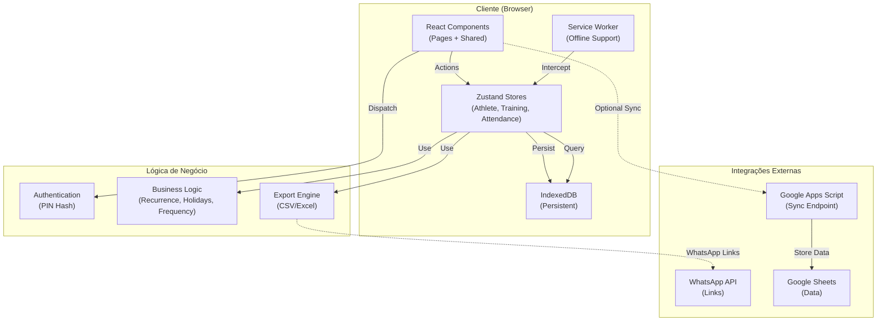

# CEPRAEA — Arquitetura Técnica e Especificações de Sistema

**Versão:** 1.2.0  
**Data:** 2 de maio de 2026  
**Escopo:** Sistema PWA para Gestão de Treinos, Controle de Presença e Scout Tático  
**Status:** Produção

---

## 1. Visão Geral do Sistema

### 1.1 Objetivo do Sistema

CEPRAEA é uma **Progressive Web Application (PWA)** de código aberto destinada a treinar, rastrear presença e gerenciar atletas de forma colaborativa e sem restrições técnicas ou de infraestrutura.

O sistema oferece:
- **Gestão de atletas** com categorias, níveis e status de atividade
- **Agendamento inteligente de treinos** com detecção automática de conflitos com feriados
- **Controle de presença** com confirmação via link público ou painel administrativo
- **Relatórios de frequência** e análise de participação
- **Scout Tático** com registro de eventos de jogo em tempo real (fases, sistemas, ações individuais)
- **Sincronização remota** com Google Apps Script para armazenamento centralizado
- **Integração com WhatsApp** para comunicação com atletas
- **Exportação de dados** em CSV e Excel
- **Autenticação por PIN** para acesso simples
- **Funcionalidade offline** via cache e IndexedDB
- **Identidade visual oficial** com logo/logomarca CEPRAEA integrados

### 1.2 Problema que Resolve

Treinos comunitários, associações desportivas e pequenos times precisam rastrear presença sem:
- Infraestrutura de servidor complexa
- Custo financeiro ou configuração técnica elaborada
- Dependência de terceiros para armazenamento
- Perda de dados offline

CEPRAEA resolve isso sendo **totalmente funcional offline**, sincronizando opcionalmente com planilhas Google, e requerendo apenas um navegador.

### 1.3 Público-Alvo

- **Técnicos e treinadores** de equipes amadores ou profissionais
- **Gestores de centros de treinamento**
- **Comunidades desportivas** em regiões com conectividade limitada
- **Pequenas e médias organizações** que não podem investir em SaaS

### 1.4 Principais Casos de Uso

| Caso de Uso | Ator | Descrição |
|---|---|---|
| Cadastrar Atletas | Técnico | Adicionar nome, telefone, categoria, nível e status |
| Gerar Treinos | Técnico | Criar automaticamente treinos recorrentes baseado em calendário |
| Marcar Presença | Técnico | Registrar presença/ausência/justificativa após treino |
| Confirmar Presença (Link) | Atleta | Acessar link público para confirmar/rejeitar presença |
| Visualizar Dashboard | Técnico | Ver resumo: treinos, atletas, conflitos com feriados, frequência |
| Consultar Relatórios | Técnico | Gerar relatórios de frequência por período |
| Exportar Dados | Técnico | Baixar CSV/Excel com dados de treinos, presença |
| Sincronizar Remoto | Técnico | Enviar confirmações de presença para Google Apps Script |
| Configurar Sistema | Técnico | Definir PIN, nome da equipe, técnico responsável, URL do app |
| Scout de Jogo | Técnico | Criar jogo e registrar eventos táticos ao vivo (fase, sistema, atletas, resultado) |
| Revisar Scout | Técnico | Visualizar timeline de eventos de um jogo registrado |

### 1.5 Escopo Funcional e Não Funcional

#### Escopo Funcional
- ✅ Cadastro, atualização e remoção de atletas
- ✅ Criação automática de treinos recorrentes (quinta + domingo)
- ✅ Alertas de conflito com feriados nacionais, estaduais e municipais
- ✅ Registro de presença com múltiplos status (presente, ausente, justificado, pendente)
- ✅ Link público de confirmação por atleta
- ✅ Relatórios de frequência por atleta e por treino
- ✅ Exportação em CSV e Excel
- ✅ Sincronização com Google Sheets via Apps Script
- ✅ Notificações via WhatsApp (links de confirmação)
- ✅ Autenticação PIN com hash SHA-256
- ✅ Scout Tático: criação de jogos e registro de eventos ao vivo (fase, sistema, atletas, placar, análise)
- ✅ Identidade visual oficial (logo/logomarca SVG) em Login, Sidebar, LoadingSpinner, ExportPage e ícones PWA

#### Escopo Não Funcional
- ✅ Funcionalidade offline completa
- ✅ PWA com instalação em dispositivos móveis
- ✅ Responsivo (mobile-first)
- ✅ Performance: carregamento < 3s em 4G
- ✅ Armazenamento local (IndexedDB) - sem limite dependendo do dispositivo
- ✅ Compatibilidade: Chrome, Firefox, Safari, Edge (últimas 2 versões)
- ✅ Acessibilidade básica (WCAG 2.1 AA parcial)

#### Out of Scope
- ❌ Autenticação OAuth/SAML
- ❌ Controle de permissões por função (apenas administrativo)
- ❌ Integração com sistemas de folha de pagamento
- ❌ Análise preditiva ou machine learning
- ❌ Suporte a múltiplos idiomas (apenas português)
- ❌ API GraphQL

---

## 2. Arquitetura Geral

### 2.1 Descrição da Arquitetura

CEPRAEA adota uma arquitetura **cliente-centric offline-first** com sincronização opcional:

```
┌─────────────────────────────────────────────────────────┐
│                    Browser/PWA App                       │
│ ┌──────────────────────────────────────────────────────┐ │
│ │              React SPA (Vite + React 19)             │ │
│ │ ┌──────────────────────────────────────────────────┐ │ │
│ │ │           Pages (Lazy-loaded)                   │ │ │
│ │ │ • Dashboard • Athletes • Trainings • Reports    │ │ │
│ │ └────────────────────────┬─────────────────────────┘ │ │
│ │                          ↓                            │ │
│ │ ┌──────────────────────────────────────────────────┐ │ │
│ │ │        Zustand Global State (Stores)            │ │ │
│ │ │ • AthleteStore • TrainingStore • AttendanceStore│ │ │
│ │ └────────────────────────┬─────────────────────────┘ │ │
│ │                          ↓                            │ │
│ │ ┌──────────────────────────────────────────────────┐ │ │
│ │ │       IndexedDB (Local Persistence)             │ │ │
│ │ │ • athletes • trainings • attendance • settings   │ │ │
│ └────────────────────────┬─────────────────────────┘ │ │
│                          ↓                            │ │
│ ┌──────────────────────────────────────────────────┐ │ │
│ │              Service Worker (Workbox)            │ │ │
│ │ • Cache-first strategy • Offline support         │ │ │
│ └────────────────────────┬─────────────────────────┘ │ │
└─────────────────────────│──────────────────────────────┘
                          │
                          ↓ (Optional Sync)
            ┌─────────────────────────────┐
            │  Google Apps Script          │
            │  (Sync Endpoint)             │
            │                              │
            │  • Validate Secret           │
            │  • Store to Google Sheets    │
            │  • Return Records            │
            └──────────────────────────────┘
```

### 2.2 Componentes Principais

| Componente | Responsabilidade | Tecnologia | Estado |
|---|---|---|---|
| **Frontend (SPA)** | Interface de usuário, navegação, formulários | React 19, React Router 7, Tailwind CSS | Local |
| **Global State** | Gerenciar estado global (atletas, treinos, presença, scout) | Zustand 5 | Memory + IndexedDB |
| **Persistência Local** | Armazenamento durável offline | IndexedDB (idb v8) | Dispositivo |
| **Autenticação** | Validação de acesso via PIN com hash | Web Crypto API SHA-256 | SessionStorage |
| **Lógica de Negócio** | Cálculos, validações, geração de dados | TypeScript | Determinístico |
| **Sincronização** | Push/Pull com endpoint remoto | Fetch API | Async |
| **PWA** | Instalação, offline, atualização automática | Workbox v7, vite-plugin-pwa (`autoUpdate`) | Auto |
| **Integração WhatsApp** | Geração de links e mensagens | WhatsApp Web URLs | Web |
| **Exportação** | CSV/Excel | XLSX v0.18 | Blob Download |
| **Identidade Visual** | Logo e logomarca CEPRAEA como componentes React inline SVG | CepraeaLogo.tsx, CepraeaLogomarca.tsx | Tailwind currentColor |

### 2.3 Responsabilidades de Cada Componente

#### **App.tsx** (Orquestrador de Rotas)
- Define estrutura de rotas (login, dashboard, atlas, treinos, etc.)
- Implementa lazy loading de páginas
- Aplica guards de autenticação
- Suspense boundaries para feedback de carregamento

#### **Stores (Zustand)**
- **AthleteStore**: CRUD de atletas, ordenação alfabética, status toggle
- **TrainingStore**: CRUD de treinos, geração de recorrentes, detecção de conflitos
- **AttendanceStore**: Upsert de presença, cálculo de frequência, summaries
- **ScoutStore**: CRUD de jogos e eventos de scout, persistência em IndexedDB

#### **Database (IndexedDB)**
- Armazenamento primário offline
- Transações atômicas para integridade
- Índices em `trainings.data`, `attendance.treinoId`, `attendance.atletaId`

#### **AuthGuard**
- Middleware que valida `sessionStorage`
- Redireciona para login se não autenticado
- Carrega stores na bootstrap

#### **Lib (Lógica de Negócio)**
- `auth.ts`: Hash PIN, gerenciamento de sessão
- `holidays.ts`: Cálculo de Páscoa (Meeus/Jones/Butcher), mapa de feriados
- `recurrence.ts`: Geração de treinos recorrentes (quinta/domingo)
- `sync.ts`: Push/Pull com endpoint remoto
- `export.ts`: Formatação CSV/XLSX
- `whatsapp.ts`: Geração de mensagens e links
- `utils.ts`: Formatação de datas, telefone, percentuais

#### **Features (Módulos por Domínio)**
- `auth/`: Login com PIN
- `dashboard/`: Visão geral, alertas, próximo treino
- `athletes/`: Lista, detalhes, CRUD
- `trainings/`: Agenda, criação, detecção de conflitos
- `attendance/`: Marcação de presença por treino
- `reports/`: Relatórios de frequência, filtros por período
- `export/`: Download de dados
- `settings/`: Configuração de PIN, URLs, sincronização
- `confirm/`: Página pública de confirmação de presença
- `scout/`: Scout tático — lista de jogos, registro ao vivo de eventos (fase, sistema, atletas, placar, análise)

### 2.4 Fluxo de Dados Entre Módulos

```
Usuário (Browser)
    ↓
Components (React)
    ↓ dispatch actions
Zustand Stores
    ├→ Update Memory State
    └→ Persist to IndexedDB
    ↓ query via hooks
Components (React) → Render
    ↓ (optional)
Sync Library
    └→ Fetch (Google Apps Script)
    └→ Push Confirmations
    └→ Pull Remote Records
    ↓
Local Stores Updated
    ↓
UI Re-renders
```

**Exemplo: Registrar Presença**

1. Usuário clica "Confirmado" no formulário de presença
2. Componente chama `attendanceStore.upsert(treinoId, atletaId, 'presente')`
3. Store cria objeto `AttendanceRecord` com `id = "treinoId::atletaId"`
4. Store persiste em IndexedDB (`attendance` store)
5. Store atualiza estado React (re-render)
6. (Opcional) Se sincronização ativa, chama `pushConfirmation()` ao Google Apps Script

### 2.5 Diagrama da Arquitetura em Mermaid



### 2.6 Justificativa das Decisões Arquiteturais

#### Por que **Offline-First**?
- Comunidades desportivas podem estar em regiões com conectividade fraca
- Necessidade de registrar presença no local do treino sem depender de rede
- Reduz latência e melhora UX

#### Por que **IndexedDB**?
- Oferece armazenamento local até ~50MB sem solicitar permissão
- Suporta índices e queries eficientes
- Totalmente offline
- Alternativa: localStorage (5MB) seria insuficiente

#### Por que **Zustand**?
- Minimalista (7KB gzipped), ideal para PWA
- Sem boilerplate (comparado a Redux)
- Integração fácil com IndexedDB
- Alternativa: Pinia (mais complexa), Recoil (mais verbosa)

#### Por que **Vite**?
- Build time < 1s em desenvolvimento
- Estouro de bundling otimizado
- HMR nativo (melhor DX)
- Alternativa: Webpack (mais lento, mais verboso)

#### Por que **Tailwind CSS**?
- Utility-first, sem CSS custom
- PWA com restricações precisa ser leve (classe > CSS-in-JS)
- Suporte nativo a dark mode
- Alternativa: Material UI (heavier)

#### Por que **Google Apps Script + Sheets**?
- Endpoint gratuito (não requer servidor)
- Dados centralizados em Sheets (acesso simples)
- Sem autenticação complexa (secret + URL suficientes)
- Alternativa: Firebase (requer cartão), Supabase (backend complexo)

#### Por que **PWA com Workbox**?
- Instalação nativa em mobile
- Funcionalidade offline automática
- Sem App Store
- Alternativa: Electron (desktop only)

---

## 3. Engenharia do Sistema

### 3.1 Stack Tecnológico

#### Frontend
- **Framework**: React 19.1.0
- **Build Tool**: Vite 6.3.5
- **Linguagem**: TypeScript 5.8.3
- **CSS**: Tailwind CSS 4.1.6 + Tailwind Merge 3.3.0
- **Ícones**: Lucide React 0.511.0
- **Roteamento**: React Router DOM 7.6.0
- **Estado Global**: Zustand 5.0.4
- **PWA**: vite-plugin-pwa 1.0.0 + Workbox 7.3.0
- **Persistência**: IDB 8.0.3

#### Backend (Opcional)
- **Sincronização**: Google Apps Script (JavaScript 1.0)
- **Armazenamento**: Google Sheets (API v4)

#### Utilitários
- **Formatação**: clsx 2.1.1 (classname merger)
- **Exportação**: XLSX 0.18.5 (Excel/CSV)
- **Criptografia**: Web Crypto API (nativa)
- **HTTP**: Fetch API (nativa)

#### DevOps
- **Hospedagem**: Vercel
- **VCS**: Git/GitHub
- **Container**: Não utiliza (edge function via Vercel)

### 3.2 Estrutura de Pastas e Organização do Código

```
cepraea-pwa/
├── public/                      # Assets estáticos
│   ├── robots.txt
│   ├── cepraea-logo.svg         # Logo CEPRAEA (fill=currentColor)
│   └── cepraea-logomarca.svg    # Logomarca CEPRAEA (fill=currentColor)
├── src/
│   ├── App.tsx                  # Orquestrador de rotas (SPA root)
│   ├── main.tsx                 # Entry point (React bootstrap)
│   ├── index.css                # Tailwind + Custom styles
│   ├── vite-env.d.ts           # Vite types
│   │
│   ├── assets/
│   │   └── brand/              # Fontes SVG originais (fill="black")
│   │       ├── CEPRAEA LOGO.svg
│   │       └── CEPRAEA LOGOMARCA.svg
│   │
│   ├── db/
│   │   └── index.ts            # IndexedDB schema v2 + operations
│   │
│   ├── types/
│   │   └── index.ts            # Interfaces (Athlete, Training, Scout, etc.)
│   │
│   ├── lib/                     # Business logic (pure functions)
│   │   ├── auth.ts             # PIN hash + session
│   │   ├── holidays.ts         # Feriados + Páscoa
│   │   ├── recurrence.ts       # Geração de treinos
│   │   ├── sync.ts             # Push/Pull com Apps Script
│   │   ├── export.ts           # CSV/Excel generation
│   │   ├── whatsapp.ts         # WhatsApp messages
│   │   └── utils.ts            # Formatação de datas/telefone
│   │
│   ├── stores/                  # Zustand stores (state + persistence)
│   │   ├── athleteStore.ts
│   │   ├── trainingStore.ts
│   │   ├── attendanceStore.ts
│   │   └── scoutStore.ts       # Scout: jogos + eventos
│   │
│   ├── features/                # Feature modules (by domain)
│   │   ├── auth/
│   │   │   └── pages/LoginPage.tsx
│   │   ├── dashboard/
│   │   │   └── pages/DashboardPage.tsx
│   │   ├── athletes/
│   │   │   ├── components/AthleteForm.tsx
│   │   │   └── pages/
│   │   │       ├── AthletesPage.tsx
│   │   │       └── AthleteDetailPage.tsx
│   │   ├── trainings/
│   │   │   ├── components/TrainingForm.tsx + HolidayAlert.tsx
│   │   │   └── pages/
│   │   │       ├── TrainingsPage.tsx
│   │   │       └── TrainingDetailPage.tsx
│   │   ├── reports/
│   │   │   └── pages/ReportsPage.tsx
│   │   ├── export/
│   │   │   └── pages/ExportPage.tsx
│   │   ├── settings/
│   │   │   └── pages/SettingsPage.tsx
│   │   ├── confirm/
│   │   │   └── pages/PublicConfirmPage.tsx
│   │   └── scout/
│   │       ├── constants.ts    # Sets, equipes, fases, sistemas, ações
│   │       ├── components/EventForm.tsx
│   │       └── pages/
│   │           ├── ScoutGamesPage.tsx   # Lista de jogos
│   │           └── ScoutLivePage.tsx    # Registro ao vivo de eventos
│   │
│   └── shared/
│       ├── components/          # Reusable UI components
│       │   ├── Badge.tsx
│       │   ├── Button.tsx
│       │   ├── CepraeaLogo.tsx      # SVG inline: símbolo CEPRAEA
│       │   ├── CepraeaLogomarca.tsx # SVG inline: logomarca completa
│       │   ├── ConfirmDialog.tsx
│       │   ├── EmptyState.tsx
│       │   ├── LoadingSpinner.tsx
│       │   ├── Modal.tsx
│       │   └── UpdatePrompt.tsx
│       └── layouts/
│           ├── AppLayout.tsx    # Header + Nav (com CepraeaLogomarca) + Outlet
│           └── AuthGuard.tsx    # Middleware de autenticação
│
├── apps-script/
│   └── Code.gs                  # Google Apps Script (endpoint)
│
├── icons/                       # PWA icons regenerados com identidade visual
│   ├── icon-192.png            # Fundo roxo #1e1040 + logo lime #a3e635
│   ├── icon-512.png
│   ├── icon-maskable-192.png
│   └── icon-maskable-512.png
│
├── .files/                      # Arquivos de referência do projeto (rastreados no git)
│   └── scout.xlsx              # Planilha-base de referência para o módulo Scout
│                               # Define estruturas de eventos, fases, sistemas e ações
│
├── .gitignore
├── .gitattributes
├── index.html                   # HTML base
├── package.json                 # Dependências
├── tsconfig.json               # TypeScript config
├── tsconfig.node.json          # TypeScript config (build)
├── vite.config.ts              # Vite config
├── vercel.json                 # Vercel deployment
└── CEPRAEA.md                  # Este documento
```

### 3.3 Padrões de Projeto Aplicados

| Padrão | Implementação | Benefício |
|---|---|---|
| **Repository Pattern** | IndexedDB abstrato via `db/index.ts` | Desacoplamento de persistência |
| **Observer Pattern** | Zustand stores + React hooks | Reatividade automática |
| **Factory Pattern** | Store methods (`add()`, `update()`) | Criação controlada de entidades |
| **Singleton Pattern** | `getDB()` com lazy initialization | Única conexão IndexedDB |
| **Module Pattern** | Lib functions (auth, holidays, sync) | Encapsulamento de lógica |
| **Strategy Pattern** | Export functions (CSV vs XLSX) | Polimorfismo de formatação |
| **Guard Pattern** | `AuthGuard` middleware | Validação de rotas |
| **Provider Pattern** | Zustand stores como "providers" | Injeção de dependências |

### 3.4 Estratégia de Modularização

O projeto segue **modularização por domínio (DDD-light)**:

```
Domínios:
├── Auth (Autenticação)
│   └── Responsabilidade: Hash PIN, sessão
│   └── Arquivo: lib/auth.ts
│
├── Athlete (Atletas)
│   ├── Store: athleteStore.ts
│   ├── Types: Athlete, AthleteStatus
│   └── Features: AthletesPage, AthleteForm, AthleteDetailPage
│
├── Training (Treinos)
│   ├── Store: trainingStore.ts
│   ├── Types: Training, TrainingStatus, TrainingType
│   ├── Business: recurrence.ts, holidays.ts
│   └── Features: TrainingsPage, TrainingForm, HolidayAlert
│
├── Attendance (Presença)
│   ├── Store: attendanceStore.ts
│   ├── Types: AttendanceRecord, AttendanceStatus
│   └── Features: PublicConfirmPage (link público)
│
├── Reporting (Relatórios)
│   ├── Calculations: attendanceStore methods
│   ├── Types: FrequencyReport, TrainingSummary
│   └── Features: ReportsPage
│
├── Scout (Reconhecimento Tático)
│   ├── Store: scoutStore.ts
│   ├── Types: ScoutGame, ScoutEvent, ScoutAthleteBlock, ScoutGameStatus
│   ├── Constants: sets, equipes, fases, sistemas, laçados, resultados
│   │             (fonte de verdade: .files/scout.xlsx)
│   └── Features: ScoutGamesPage, ScoutLivePage, EventForm
│
├── Sync (Sincronização)
│   ├── Business: sync.ts
│   └── Features: SettingsPage (config)
│
├── Export (Exportação)
│   ├── Business: export.ts
│   └── Features: ExportPage
│
└── Shared (Componentes Reutilizáveis)
    ├── UI: Button, Modal, Badge, CepraeaLogo, CepraeaLogomarca, etc.
    └── Layout: AppLayout, AuthGuard
```

**Benefício**: Fácil localizar código relacionado, reuso de tipos, escalabilidade.

### 3.5 Dependências Internas e Externas

#### Externas (npm packages)
```
react@19.1.0                    ← Framework principal
react-dom@19.1.0               ← Renderização DOM
react-router-dom@7.6.0         ← Roteamento SPA
zustand@5.0.4                  ← Estado global
idb@8.0.3                       ← IndexedDB wrapper
tailwindcss@4.1.6              ← CSS framework
tailwind-merge@3.3.0           ← Classe merger
lucide-react@0.511.0           ← Ícones
clsx@2.1.1                     ← className utility
xlsx@0.18.5                    ← Excel/CSV export
vite-plugin-pwa@1.0.0          ← PWA builder
workbox-window@7.3.0           ← Service Worker
typescript@5.8.3               ← Type checking
vite@6.3.5                     ← Build tool
@tailwindcss/vite@4.1.6        ← Tailwind plugin
@vitejs/plugin-react@4.5.0     ← React HMR
```

#### Internas (módulos TypeScript)
```
src/db/
  ↓ importado por
src/stores/*
  ↓ importado por
src/features/*/pages/*.tsx

src/lib/*
  ↓ importado por
src/features/* + src/stores/*

src/types/index.ts
  ↓ importado por
tudo (tipos compartilhados)

src/shared/
  ↓ importado por
src/features/* (componentes reutilizáveis)

src/features/scout/constants.ts
  ↓ importado por
src/features/scout/pages/*.tsx + components/*.tsx
```

#### Dependências Assíncronas (Runtime)
- **Google Apps Script** (optional): endpoint remoto para sync
- **Google Fonts**: via Workbox cache
- **WhatsApp Web**: links HTTPS para abrir chats

---

## 4. Backend (Lógica de Negócio)

### 4.1 Arquitetura de Negócio

CEPRAEA não possui backend tradicional. A lógica de negócio reside no **cliente (browser)** com persistência local (IndexedDB) e sincronização **opcional** com Google Apps Script.

```
┌─ Local (Browser) ─┐    ┌─ Remote (Optional) ─┐
│ IndexedDB         │←→  │ Google Apps Script   │
│ • Lógica CRUD     │    │ • Validação Secret   │
│ • Cálculos        │    │ • Persist to Sheets  │
│ • Validações      │    │ • Return Records     │
└───────────────────┘    └──────────────────────┘
```

### 4.2 Serviços e Operações de Negócio

#### **CRUD de Atletas** (`athleteStore.ts`)

```typescript
// Read
loadAll(): Promise<void>
getById(id: string): Athlete | undefined

// Create
add(data: Omit<Athlete, 'id' | 'createdAt' | 'updatedAt'>): Promise<Athlete>

// Update
update(id: string, data: Partial<Athlete>): Promise<void>
toggleStatus(id: string): Promise<void>

// Delete
remove(id: string): Promise<void>

// Sync
// Pull-before-push: só envia registros onde local.updatedAt > remote.updatedAt
pushAllToRemote(config: SyncConfig): Promise<{ pushed: number; skipped: number }>
syncFromRemote(config: SyncConfig): Promise<void>
```

#### **CRUD de Treinos** (`trainingStore.ts`)

```typescript
// Read
loadAll(): Promise<void>
getById(id: string): Training | undefined

// Create
add(data: Omit<Training, 'id' | 'createdAt' | 'updatedAt'>): Promise<Training>
addExtra(data: omit): Promise<Training>
// count = treinos gerados; synced = false se syncConfig ausente (sem credenciais)
generateRecurring(): Promise<{ count: number; synced: boolean }>

// Update
update(id: string, data: Partial<Training>): Promise<void>
updateStatus(id: string, status: TrainingStatus): Promise<void>

// Delete
remove(id: string): Promise<void>

// Business Logic
getConflicts(): HolidayConflict[]  // Treinos em feriados

// Sync
// Pull-before-push: só envia registros onde local.updatedAt > remote.updatedAt
pushAllToRemote(config: SyncConfig): Promise<{ pushed: number; skipped: number }>
syncFromRemote(config: SyncConfig): Promise<void>
```

#### **Registro de Presença** (`attendanceStore.ts`)

```typescript
// Read
loadAll(): Promise<void>
loadForTraining(treinoId: string): Promise<void>
getForTraining(treinoId: string): AttendanceRecord[]
getForAthlete(atletaId: string): AttendanceRecord[]

// Create/Update
upsert(
  treinoId: string,
  atletaId: string,
  status: AttendanceStatus,
  opts?: { justificativa?: string; confirmadoPelaAtleta?: boolean }
): Promise<void>

// Analytics
getTrainingSummary(treinoId: string, totalAtivos: number): TrainingSummary
getFrequencyReports(fromISO?: string, toISO?: string): FrequencyReport[]
getAthleteFrequency(atletaId: string, fromISO?: string, toISO?: string): FrequencyReport
```

### 4.3 Modelos de Dados

#### **Atleta**
```typescript
interface Athlete {
  id: string              // UUID v4
  nome: string            // Obrigatório
  telefone: string        // Formato: 11987654321
  categoria?: string      // Ex: "Sub-18", "Senior"
  nivel?: string          // Ex: "Iniciante", "Intermediário"
  status: AthleteStatus   // 'ativo' | 'inativo'
  observacoes?: string    // Notas livres
  createdAt: string       // ISO 8601
  updatedAt: string       // ISO 8601
}
```

#### **Treino**
```typescript
interface Training {
  id: string              // UUID v4
  tipo: TrainingType      // 'recorrente' | 'extra'
  status: TrainingStatus  // 'agendado' | 'realizado' | 'cancelado'
  data: string            // YYYY-MM-DD
  horaInicio: string      // HH:MM
  horaFim: string         // HH:MM
  local?: string          // Descrição do local
  observacoes?: string    // Notas
  feriadoOrigem?: string  // Se em feriado, data ISO do feriado
  criadoManualmente: boolean  // true se usuário criou, false se recorrente
  createdAt: string       // ISO 8601
  updatedAt: string       // ISO 8601
}
```

#### **Registro de Presença**
```typescript
interface AttendanceRecord {
  id: string              // Deterministico: "treinoId::atletaId"
  treinoId: string        // Foreign key para Training
  atletaId: string        // Foreign key para Athlete
  status: AttendanceStatus // 'presente' | 'ausente' | 'justificado' | 'pendente'
  justificativa?: string  // Motivo da ausência/justificativa
  confirmadoPelaAtleta: boolean  // true se veio de link público
  registradoEm: string    // ISO 8601 (timestamp do registro)
}
```

#### **Feriado**
```typescript
interface Holiday {
  data: string            // YYYY-MM-DD
  nome: string            // Descrição
  tipo: HolidayType       // 'nacional' | 'estadual' | 'municipal'
}
```

#### **Scout — Jogo**
```typescript
type ScoutGameStatus = 'em_andamento' | 'finalizado'

interface ScoutGame {
  id: string
  data: string              // "YYYY-MM-DD"
  equipeAnalisada: string   // Ex: "CEPRAEA"
  adversario: string        // Ex: "ADM Maricá"
  local?: string
  observacoes?: string
  status: ScoutGameStatus
  createdAt: string         // ISO 8601
  updatedAt: string         // ISO 8601
}
```

#### **Scout — Evento de Jogo**
```typescript
interface ScoutAthleteBlock {
  atleta?: string
  funcao?: string
  categoria?: string
  acao?: string
  resultadoInd?: string
}

interface ScoutEvent {
  id: string
  jogoId: string             // Foreign key para ScoutGame
  tempoJogo?: string         // Ex: "13:45"
  set?: string               // Ex: "1º SET"
  controleJogo?: string      // Ex: "FIM DO SET"
  placarCEPRAEA: number
  placarAdversario: number
  posse?: string             // 'CEPRAEA' | 'Adversário'
  faseJogo?: string          // Ex: "Ataque posicionado"
  sistema?: string           // Ex: "Ataque 3:1 ESP central + pivô destra"
  ladoAcao?: string
  goleira?: string
  reposicao?: string
  ataques: ScoutAthleteBlock[]   // até 4
  defesas: ScoutAthleteBlock[]   // até 3
  analise?: string           // 'Positiva' | 'Neutra' | 'Negativa' | 'Revisar'
  resultadoColetivo?: string // Ex: "Gol 2 pontos"
  observacao?: string
  revisarVideo: boolean
  createdAt: string          // ISO 8601
}
```

#### **Configurações da Aplicação**
```typescript
interface AppSettings {
  nomeEquipe: string
  nomeTecnico: string
  telefoneTecnico: string
  localPadrao: string
  semanasFuturas: number  // Quantas semanas gerar treinos automáticos
  pinHash: string         // SHA-256 do PIN
  appUrl: string          // URL do app (para links públicos)
  syncEndpointUrl?: string
  syncSecret?: string
  lastSyncAt?: string
}
```

### 4.4 Regras de Negócio

#### Geração de Treinos Recorrentes
- **Padrão fixo**:
  - Quinta-feira às 20:00-21:30
  - Domingo às 07:30-09:00
- **Prospectiva**: Próximas `semanasFuturas` (padrão 12)
- **Não gerar**: Treinos no passado, duplicatas em mesma data/hora
- **Marcação**: Se cair em feriado, marca `feriadoOrigem` para alertar

#### Detecção de Conflitos com Feriados
- **Algoritmo de Páscoa**: Meeus/Jones/Butcher para datas móveis
- **Feriados cobertos**:
  - Nacionais fixos (13) + móveis (5) = 18 por ano
  - Estaduais (RJ): São Jorge (23/04)
  - Municipais (Rio): São Sebastião (20/01)
- **Sugestão de alternativas**: Sábado/segunda/domingo seguinte

#### Cálculo de Frequência
```
Frequência % = (Presentes / Total de Treinos Realizados) * 100

Período: Configurável por data início e fim (ISO 8601)
Filtros: 
  - Apenas treinos com status 'realizado'
  - Apenas atletas com status 'ativo'
  - Apenas registros com status final (não 'pendente')
```

#### Confirmação de Presença
- **Via formulário admin**: Registra presença manualmente
- **Via link público**: Atleta acessa `/confirmar/:treinoId/:atletaId`
  - Marca `confirmadoPelaAtleta: true`
  - Sincroniza se endpoint configurado
- **Status disponíveis**: presente, ausente, justificado

### 4.5 Validações

#### Validação de Atleta
```
✓ Nome: obrigatório, min 3 chars, max 100
✓ Telefone: obrigatório, 10-11 dígitos
✓ Categoria: opcional
✓ Nível: opcional
✓ Status: enum (ativo | inativo)
```

#### Validação de Treino
```
✓ Data: obrigatório, YYYY-MM-DD, não no passado
✓ Hora início: obrigatório, HH:MM, válido (00:00-23:59)
✓ Hora fim: obrigatório, HH:MM, > hora início
✓ Local: opcional
✓ Tipo: enum (recorrente | extra)
✓ Status: enum (agendado | realizado | cancelado)
```

#### Validação de PIN
```
✓ Comprimento: min 4 chars
✓ Hashado com SHA-256 + salt "cepraea_salt_2025"
✓ Comparação de hash para login
```

### 4.6 Sincronização Remota (Opcional)

#### Google Apps Script Endpoint

**Setup obrigatório**:
1. Criar projeto em script.google.com
2. Cole `apps-script/Code.gs`
3. Gerar secret: `generateSecret()` (32 hex chars)
4. Deploy como "Aplicativo da Web"
5. Configurar em Settings > Sync

**Protocolo**:
```
URL: https://script.google.com/macros/d/{...}/usercallback?...
Query Params:
  ├── secret: string (validação)
  ├── action: string (ping | confirm | list)
  └── [params específicos por ação]

Ações:
  ├── ping: Valida conexão e secret
  ├── confirm: Envia 1 registro de presença (upsert)
  └── list: Retorna registros remotos desde timestamp
```

**Exemplo: Confirmar Presença**
```
POST https://script.google.com/macros/d/.../usercallback
?secret=abc123def...
&action=confirm
&treinoId=uuid-training
&atletaId=uuid-athlete
&nomeAtleta=Maria Silva
&status=presente
&timestamp=2025-04-29T14:30:00Z
&origem=link

Response:
{
  "ok": true,
  "action": "created" | "updated"
}
```

#### Estratégia de Sincronização
- **Direção**: Bidirecional (push + pull)
- **Push local → remoto**: Via `pushAllToRemote()` nos stores — padrão _pull-before-push_: busca `updatedAt` remotos, só envia registros onde `local.updatedAt > remote.updatedAt`. Evita sobrescrita de dados mais recentes no servidor.
- **Pull remoto → local**: `syncFromRemote()` nos stores — baixa todos os registros remotos e faz upsert local
- **Disparo manual**: Settings > "Sincronizar tudo agora" — executa push (athletes + trainings) **depois** pull (athletes + trainings + attendance). Exibe contagem separada: "X enviado(s), Y recebido(s)".
- **Disparo automático no boot**: `main.tsx` inicia pull em background após renderização inicial (não-bloqueante). Se `syncConfig` não estiver configurado, o pull é silenciosamente pulado.
- **Conflito**: Pull-before-push no envio. No recebimento: remoto sobrescreve local (last write wins por `updatedAt`).
- **Aviso de sincronização pendente**: `generateRecurring()` retorna `{ synced: false }` quando `syncConfig` ausente; `TrainingsPage` exibe toast de 5s orientando o usuário a ir em Configurações.

> **Nota:** O Apps Script (`Code.gs`) **não compara `updatedAt`** antes de sobrescrever — aceita qualquer upsert recebido. A proteção contra sobrescrita indevida é responsabilidade do cliente via `pushAllToRemote()`.

### 4.7 Eventos do Sistema

| Evento | Trigger | Ação |
|---|---|---|
| `athlete:created` | usuário cria atleta | Log + Store + IndexedDB |
| `athlete:updated` | usuário edita atleta | Log + Store + IndexedDB |
| `athlete:deleted` | usuário remove atleta | Log + Store + IndexedDB |
| `training:generated` | generar recorrentes | Count + Store + IndexedDB |
| `training:conflict` | treino em feriado | Alert no Dashboard |
| `attendance:confirmed` | presença registrada | Sync push (opcional) |
| `attendance:pendente` | treino realizado mas sem presença | Alerta visual |
| `sync:success` | push para Apps Script bem-sucedido | Update lastSyncAt |
| `sync:error` | falha na sincronização | Toast error |
| `training:sync-pending` | `generateRecurring()` sem syncConfig | Toast 5s orientando a ir em Configurações |
| `sw:updated` | Service Worker novo ativou automaticamente | Toast 4s: "App atualizado para a versão mais recente." |

---

## 5. Frontend

### 5.1 Estrutura da Interface

```
App (Router)
├── LoginPage (pública)
│   └── PIN form + CepraeaLogo
│
├── AuthGuard (private)
│   └── AppLayout
│       ├── Sidebar desktop (CepraeaLogomarca + nav)
│       ├── Navigation (bottom tabs mobile)
│       └── Content Area (rotas privadas)
│           ├── DashboardPage
│           ├── AthletesPage
│           │   └── AthleteDetailPage
│           ├── TrainingsPage
│           │   └── TrainingDetailPage
│           ├── ScoutGamesPage  (/scout)
│           │   └── ScoutLivePage (/scout/:id/ao-vivo)
│           ├── ReportsPage
│           ├── ExportPage (CepraeaLogomarca no header)
│           └── SettingsPage
│
└── PublicConfirmPage (link: /confirmar/:treinoId/:atletaId)
    └── Formulário de confirmação
```

### 5.2 Fluxos Principais de Navegação

#### **Fluxo 1: Primeiro Acesso (Setup)**
```
Acessa app → LoginPage → Insere PIN 2x → Valida confirmação → Home → DashboardPage
```

#### **Fluxo 2: Login Diário**
```
Acessa app → LoginPage → Insere PIN → Valida hash → Home → DashboardPage
```

#### **Fluxo 3: Gerenciar Treinos**
```
DashboardPage → "Treinos" → TrainingsPage
  ├── Gerar automáticos → Upsert N treinos → Refresh lista
  ├── Criar manual → TrainingForm → Upsert 1 treino
  ├── Resolver conflito → HolidayAlert → Sugerir datas
  └── Editar/Deletar → TrainingDetailPage → Update/Remove
```

#### **Fluxo 4: Registrar Presença**
```
TrainingDetailPage → Formulário de atletas → Checkbox status → Upsert attendanceStore → Sync (opcional)
```

#### **Fluxo 5: Atleta Confirma (Link Público)**
```
Recebe link WhatsApp → /confirmar/:treinoId/:atletaId → PublicConfirmPage → Botões (Vou/Não vou) → Upsert + Sync → Sucesso
```

#### **Fluxo 6: Consultar Relatórios**
```
DashboardPage → "Relatórios" → ReportsPage → Filtro período → Calcula frequência % → Exibe tabela
```

#### **Fluxo 7: Exportar Dados**
```
DashboardPage → "Exportar" → ExportPage → Seleciona tipo (CSV/Excel) → Download
```

### 5.3 Componentes Principais

#### **Compartilhados** (`shared/components/`)

| Componente | Props | Casos de Uso |
|---|---|---|
| `Button` | `variant` (primary, secondary, warning), `size` (sm, md, lg), `disabled` | CTA, submit, delete |
| `Modal` | `open`, `onClose`, `title`, `children` | Formulários, confirmações |
| `Badge` | `variant` (success, warning, error, neutral, lime, yellow, red, gray), `children` | Status labels, análise scout |
| `ConfirmDialog` | `open`, `onConfirm`, `title`, `description` | Delete, cancel actions |
| `LoadingSpinner` | `size` (sm, md, lg) | Async operations (exibe CepraeaLogo acima) |
| `EmptyState` | `title`, `description`, `icon` | Listas vazias |
| `UpdatePrompt` | Toast informativo pós-atualização automática do SW | Exibido 4s após reload por novo SW (`autoUpdate`) |
| `CepraeaLogo` | `className?` | Símbolo/ícone CEPRAEA (SVG inline, `fill=currentColor`) |
| `CepraeaLogomarca` | `className?` | Logomarca completa CEPRAEA (SVG inline, `fill=currentColor`) |

#### **Layout** (`shared/layouts/`)

| Componente | Responsabilidade |
|---|---|
| `AppLayout` | Header + Navigation + Outlet |
| `AuthGuard` | Validate session + redirect |

#### **Feature Específicos**

| Feature | Componentes |
|---|---|
| auth | LoginPage (com CepraeaLogo), PIN form |
| athletes | AthletesPage, AthleteDetailPage, AthleteForm |
| trainings | TrainingsPage, TrainingDetailPage, TrainingForm, HolidayAlert |
| reports | ReportsPage (com filtros de período) |
| export | ExportPage (cabeçalho com CepraeaLogomarca, CSV/Excel) |
| settings | SettingsPage (PIN, URLs, sync config) |
| confirm | PublicConfirmPage (link público) |
| scout | ScoutGamesPage (lista de jogos), ScoutLivePage (registro ao vivo), EventForm |

### 5.4 Gerenciamento de Estado

#### **Global State (Zustand Stores)**
```typescript
// Hook usage
const athletes = useAthleteStore((s) => s.athletes)
const { add, update, remove } = useAthleteStore()

// Persist automaticamente em IndexedDB
// Carregado na bootstrap via loadAll()
```

#### **Local State (React.useState)**
- Formulários (validação, erros)
- UI (modais abertos, abas ativas)
- Filtros (período, busca)

#### **Cache de Queries**
- `useMemo` para cálculos derivados (frequência, summaries)
- Recomputa quando stores mudam

### 5.5 Integração com APIs

#### **Leitura de Store**
```typescript
// Em componentes
const athletes = useAthleteStore((s) => s.athletes)
const training = useTrainingStore((s) => s.getById(id))
const summary = useAttendanceStore((s) => s.getTrainingSummary(id, count))
```

#### **Escrita de Store**
```typescript
// Chama action que faz persist em IndexedDB
await useAthleteStore.getState().add({ nome, telefone, ... })
await useTrainingStore.getState().generateRecurring()
await useAttendanceStore.getState().upsert(treinoId, atletaId, 'presente')
```

#### **Sincronização Remota**
```typescript
// Em components que precisam sync
import { pushConfirmation } from '@/lib/sync'

await pushConfirmation(config, {
  treinoId: training.id,
  atletaId: athlete.id,
  nomeAtleta: athlete.nome,
  status: 'presente',
  origem: 'link'
})
```

### 5.6 Responsividade e Acessibilidade

#### Responsive Design
- **Mobile-first**: Tailwind breakpoints (sm, md, lg, xl)
- **Viewport**: `<meta name="viewport" content="width=device-width, initial-scale=1.0, viewport-fit=cover" />`
- **Safe areas**: iOS notch support via `viewport-fit=cover`

#### Acessibilidade
- ✓ Alt text em ícones (via `aria-hidden` em decorativos)
- ✓ Contraste WCAG AA em cores principais (azul/branco)
- ✓ Tamanho mínimo de botão: 44x44px (thumb-friendly)
- ✓ Rótulos em formulários (`<label htmlFor>`)
- ⚠️ Pendente: Testes com screen readers, ARIA roles completos

#### Temas
- Dark mode: Suportado via Tailwind (classe `dark:`)
- Light mode: Padrão (cores em `tailwind.config.ts`)

---

## 6. Banco de Dados

### 6.1 Modelo Conceitual

```
┌─────────────┐
│   Athlete   │
├─────────────┤
│ id (PK)     │
│ nome        │
│ telefone    │
│ categoria   │
│ nível       │
│ status      │
│ createdAt   │
│ updatedAt   │
└──────┬──────┘
       │ 1
       │
       ├──────────────┐
       │              │
       │ 1..N         │ 1..N
       ↓              ↓
┌──────────────┐  ┌─────────────────┐
│   Training   │  │ AttendanceRecord│
├──────────────┤  ├─────────────────┤
│ id (PK)      │  │ id (PK)         │
│ tipo         │  │ treinoId (FK)   │
│ status       │  │ atletaId (FK)   │
│ data (IDX)   │  │ status          │
│ horaInicio   │  │ justificativa   │
│ horaFim      │  │ confirmadoAtleta│
│ local        │  │ registradoEm    │
│ feriadoOrigem│  └─────────────────┘
│ criadoManual │
│ createdAt    │
│ updatedAt    │
└──────────────┘
       ↓
     1│
      └──────────────┐
                     │ múltiplos
                     ↓
            ┌─────────────────┐
            │   Holiday       │
            ├─────────────────┤
            │ data (PK)       │
            │ nome            │
            │ tipo (nacional  │
            │      estadual   │
            │      municipal) │
            └─────────────────┘
```

### 6.2 Entidades Principais

| Entidade | Chave Primária | Índices | Relacionamento |
|---|---|---|---|
| **Athlete** | `id` (UUID) | - | 1:N com Attendance |
| **Training** | `id` (UUID) | `data` (query por período) | 1:N com Attendance |
| **AttendanceRecord** | `id` (composto: `treinoId::atletaId`) | `treinoId`, `atletaId` | N:1 com Athlete + Training |
| **Settings** | `key` (string) | - | Key-value store |

### 6.3 Schema IndexedDB

#### Object Store: `athletes`
```typescript
createObjectStore('athletes', { keyPath: 'id' })

Índices: Nenhum (queries por ID apenas)
Registros típicos: 50-500
```

#### Object Store: `trainings`
```typescript
createObjectStore('trainings', { keyPath: 'id' })
  .createIndex('by-data', 'data')  // Para queries de período

Índices:
  - by-data: Permite buscar treinos entre 2 datas
Registros típicos: 100-1000 (12 semanas * 2 treinos/semana * N anos)
```

#### Object Store: `attendance`
```typescript
createObjectStore('attendance', { keyPath: 'id' })
  .createIndex('by-treino', 'treinoId')  // Para listar atletas num treino
  .createIndex('by-atleta', 'atletaId')  // Para listar treinos de 1 atleta

Índices:
  - by-treino: Queries tipo getTrainingSummary
  - by-atleta: Queries tipo getAthleteFrequency
Registros típicos: 5000-50000 (treinos * atletas)
```

#### Object Store: `settings`
```typescript
createObjectStore('settings', { keyPath: 'key' })

Registros conhecidos:
  - pinHash (string)
  - appSettings (AppSettings)
  - lastSyncAt (string)
  - syncSecret (string)
```

#### Object Store: `scoutGames` _(novo — DB v2)_
```typescript
createObjectStore('scoutGames', { keyPath: 'id' })
  .createIndex('by-data', 'data')  // Para ordenar/filtrar por data

Índices:
  - by-data: Listagem cronológica de jogos
Registros típicos: 10-200
```

#### Object Store: `scoutEvents` _(novo — DB v2)_
```typescript
createObjectStore('scoutEvents', { keyPath: 'id' })
  .createIndex('by-jogo', 'jogoId')  // Para buscar todos eventos de um jogo

Índices:
  - by-jogo: Timeline de eventos do ScoutLivePage
Registros típicos: 50-2000 (jogos * eventos/jogo)
```

### 6.4 Operações de Query Comuns

```typescript
// Read single
const athlete = await db.get('athletes', id)

// Read all
const athletes = await db.getAll('athletes')

// Read by index
const trainingsByDate = await db.getAllFromIndex('trainings', 'by-data')
const attendanceForTraining = await db.getAllFromIndex('attendance', 'by-treino', treinoId)

// Write
await db.put('athletes', athleteObject)

// Delete
await db.delete('athletes', id)

// Transaction
const tx = db.transaction(['athletes', 'trainings'], 'readwrite')
await tx.objectStore('athletes').put(athlete)
await tx.objectStore('trainings').put(training)
await tx.done
```

### 6.5 Índices

| Store | Nome | Campo | Uso |
|---|---|---|---|
| trainings | `by-data` | `data` (YYYY-MM-DD) | Filtro período, paginação |
| attendance | `by-treino` | `treinoId` | Resumo do treino, marcação presença |
| attendance | `by-atleta` | `atletaId` | Histórico de frequência |
| scoutGames | `by-data` | `data` (YYYY-MM-DD) | Lista cronológica de jogos |
| scoutEvents | `by-jogo` | `jogoId` | Timeline de eventos de um jogo |

### 6.6 Estratégia de Migração

**Versão 1 (Inicial)**
- DB_VERSION = 1
- Object stores: `athletes`, `trainings`, `attendance`, `settings`

**Versão 2 (Atual)**
- DB_VERSION = 2
- Adicionados: `scoutGames` (idx: by-data) e `scoutEvents` (idx: by-jogo)
- IDB migrou automáticamente via `upgrade()` handler (sem perda de dados)

**Futuro (v3+)**
- Incrementar `DB_VERSION`
- Adicionar novo object store em `upgrade()` handler
- IDB auto-migra dados sem perda

### 6.7 Estratégia de Backup e Retenção

#### Backup Local
- **Frequência**: Contínuo (cada operação escreve em IndexedDB)
- **Retenção**: Até limite de cota do navegador (~50MB+)
- **Exportação manual**: Via ExportPage (CSV/Excel)

#### Backup Remoto (Opcional)
- **Via Google Apps Script**: Confirmações de presença em Google Sheets
- **Frequência**: Apenas de registros confirmados
- **Retenção**: Indefinida (Google Sheets)

#### Política de Retenção
- **Dados locais**: Sem exclusão automática (usuário decide)
- **Limpeza manual**: Settings > "Limpar dados locais" (pendente de implementação)
- **Dados remotos**: Às vezes nos Sheets (usuário gerencia)

---

## 7. Segurança

### 7.1 Autenticação

#### Modelo de Autenticação
- **Tipo**: PIN + Hash SHA-256 (não requer usuário/senha)
- **Fluxo**:
  1. Primeiro acesso: Insere PIN 2x (criação)
  2. Acesso: Insere PIN 1x (verificação)

#### Implementação
```typescript
// Hash
const hash = await crypto.subtle.digest('SHA-256', 
  encoder.encode(pin + 'cepraea_salt_2025')
)

// Verificação
const storedHash = await getSetting('pinHash')
const matches = (hash === storedHash)

// Sessão
sessionStorage.setItem('cepraea_session', '1')  // Session-only (não persiste)
```

#### Segurança
- ✓ SHA-256: 256-bit output, resistente a collision
- ✓ Salt: Adicionado para evitar rainbow tables
- ✓ Session Storage: Apenas em memoria (limpo ao fechar aba)
- ⚠️ Limitação: PIN pode ser bruteforce se conhecer salt

### 7.2 Autorização

#### Modelo
- **Sem roles**: Único grupo de usuários (técnicos)
- **Sem permissões granulares**: Acesso tudo ou nada
- **Aplicável no futuro**: Adicionar roles (admin, assistente, atleta)

#### Controle de Acesso
```typescript
// Guard verifica sessionStorage
export function AuthGuard() {
  if (!isAuthenticated()) {
    return <Navigate to="/login" replace />
  }
  return <Outlet />
}

// Rotas públicas
/login
/confirmar/:treinoId/:atletaId  (sem autenticação necessária)

// Rotas privadas
/dashboard, /atletas, /treinos, /relatorios, etc.
```

### 7.3 Controle de Acesso

#### Nível de Aplicação
- **Público**: LoginPage, PublicConfirmPage
- **Privado**: Todas as outras rotas
- **Verificação**: AuthGuard middleware

#### Nível de API (Stores)
- Sem autenticação adicional (store methods são síncronos)
- Validação de dados em entrada (formulários)

### 7.4 Criptografia

#### Em Transit
- **HTTPS obrigatório** em Vercel (SSL/TLS)
- **Google Fonts**: Cache via HTTPS
- **Sync**: HTTPS + secret em query (não ideal para dados sensíveis)

#### Em Repouso
- **IndexedDB**: Sem criptografia (storage local do navegador)
- **PIN Hash**: SHA-256 (one-way)
- **SessionStorage**: Sem criptografia (memória do navegador)

#### Recomendação Futura
- Adicionar criptografia AES-256-GCM para IndexedDB (crypto-js)
- Usar Bearer token + HTTPS para sync (não query params)

### 7.5 Proteção Contra Ataques Comuns

| Ataque | Mitigação | Status |
|---|---|---|
| **XSS** | React sanitização automática + CSP headers | ✓ Implementado |
| **CSRF** | GET-only sync endpoint (Apps Script) | ⚠️ Parcial |
| **SQL Injection** | IndexedDB não permite queries SQL | ✓ N/A |
| **Brute Force PIN** | Sem rate limiting (implementar futuro) | ⚠️ Pendente |
| **Session Hijacking** | SessionStorage + HTTPS | ✓ Implementado |
| **Man-in-the-Middle** | HTTPS obrigatório | ✓ Implementado |
| **Insecure Deserialization** | JSON parsing seguro | ✓ Implementado |

### 7.6 Gestão de Segredos

#### Segredos Necessários
- **syncSecret**: 32 hex chars (gerado aleatoriamente)
- **pinHash**: SHA-256 (computado localmente)

#### Armazenamento
- **syncSecret**: IndexedDB (settings) + documentação setup (manual)
- **pinHash**: IndexedDB (settings)
- **Nenhum secret em código** (hardcoded): ✓ Implementado

#### Rotação
- **PIN**: Usuário pode alterar em Settings
- **Sync Secret**: Regenerar em Settings e atualizar Apps Script

### 7.7 LGPD/GDPR Compliance

#### Dados Pessoais Coletados
- Nome
- Telefone
- Status de atividade
- Registros de presença
- Data/hora

#### Direitos do Usuário
- **Acesso**: ExportPage permite baixar todos os dados
- **Retificação**: Update em AthletesPage
- **Exclusão**: Delete em AthletesPage (soft delete via status = inativo)
- **Portabilidade**: ExportPage (CSV/Excel)

#### Compliance
- ✓ Consentimento: Implícito (PIN necessário)
- ✓ Direito de esquecimento: Implementável (delete + purge IndexedDB)
- ✓ Notificação**: Pendente (política de privacidade)
- ✓ Data Protection Officer: Não aplicável (sem servidor central)

#### Recomendações
- Adicionar Política de Privacidade (site)
- Implementar "Right to be forgotten" completo
- Log de acessos para auditoria

### 7.8 Auditoria e Rastreabilidade

#### O que é Registrado
- **Registros IndexedDB**: `createdAt`, `updatedAt` (timestamps)
- **Sync**: Timestamp em cada confirmação
- **Não há logs centralizados** (tudo local)

#### Auditoria de Alterações
- **Difícil rastrear quem alterou o quê** (sem multi-user)
- **Solução**: Implementar journal/transaction log

#### Recomendação Futura
- Adicionar campo `editadoPor` em registros críticos
- Manter histórico de alterações em tabela separada

---

## 8. Infraestrutura e DevOps

### 8.1 Ambientes

#### Desenvolvimento
- **Hospedagem**: Local (localhost:5173 via Vite)
- **Database**: IndexedDB local
- **Sync**: Pode-se configurar Google Apps Script local
- **Build**: `npm run dev`

#### Homologação (Staging)
- **Pendente de definição**
- **Sugestão**: Branch `staging`, deploy em Vercel preview

#### Produção
- **Hospedagem**: Vercel (zero-config)
- **Domain**: cepraea.vercel.app ou customizado
- **Database**: IndexedDB no dispositivo do usuário
- **Sync**: Google Apps Script endpoint (URL remota)
- **Build**: `npm run build`
- **Cache**: Vercel Edge + Workbox SW

### 8.2 Cloud e Servidor

#### Hospedagem Principal
- **Plataforma**: Vercel
- **Região**: Automática (geo-distribuído)
- **CDN**: Vercel Edge Network
- **TLS/SSL**: Automático (Let's Encrypt)
- **Uptime SLA**: 99.9%

#### Banco de Dados
- **Tipo**: Não aplicável (cliente-centric)
- **Backup**: Google Sheets (opcional)

#### Configuração DNS
- **Vercel**: Automática ou custom
- **Email**: Não aplicável

### 8.3 Containers e Orquestração

#### Docker (Opcional para desenvolvimento)
```dockerfile
FROM node:22-alpine
WORKDIR /app
COPY package.json .
RUN npm install
COPY . .
EXPOSE 5173
CMD ["npm", "run", "dev"]
```

#### Kubernetes
- **Não necessário** (PWA estatística + Vercel)

### 8.4 CI/CD

#### GitHub Actions (Recomendado)
```yaml
name: Build & Deploy
on:
  push:
    branches: [main, staging]

jobs:
  build:
    runs-on: ubuntu-latest
    steps:
      - uses: actions/checkout@v3
      - uses: actions/setup-node@v3
        with:
          node-version: '22'
      - run: npm ci
      - run: npm run build
      - run: npm run preview  # Verificar build

  deploy:
    needs: build
    runs-on: ubuntu-latest
    if: github.ref == 'refs/heads/main'
    steps:
      - uses: actions/checkout@v3
      - uses: vercel/action@master
        with:
          vercel-token: ${{ secrets.VERCEL_TOKEN }}
          vercel-org-id: ${{ secrets.VERCEL_ORG_ID }}
          vercel-project-id: ${{ secrets.VERCEL_PROJECT_ID }}
```

#### Vercel Deploy
- **Automático** ao push em `main`
- **Preview** para branches de feature
- **Revert** simples (rollback automático)

### 8.5 Deployment

#### Build
```bash
npm run build
# Output: dist/
# Artifacts: index.html, *.js, *.css, sw.js
```

#### Deploy Steps
1. Git push para `main`
2. GitHub Actions dispara build
3. Testes rodam (se configurado)
4. Vercel reconstrói se novo commit
5. Deploy automático em cepraea.vercel.app

#### Configuração Vercel
```json
{
  "buildCommand": "npm run build",
  "outputDirectory": "dist",
  "env": {
    "VITE_API_URL": "@vercel_api_url"
  }
}
```

### 8.6 Monitoramento

#### Application Monitoring
- **Sentry** (opcional): Rastreamento de erros
- **Vercel Analytics**: Performance insights
- **Google Analytics**: Trackear uso (opcional)

#### Health Checks
- **Endpoint**: https://cepraea.vercel.app/
- **Verificação**: HTTP 200 + Manifest válido
- **Frequência**: Manual ou 3rd-party (Uptime Monitor)

#### Logs
- **Vercel**: Build logs, Edge logs
- **Browser Console**: Errors, warnings (DevTools)
- **Nenhum server log** (serverless)

### 8.7 Escalabilidade

#### Horizontal
- **Automaticamente escalável** (PWA estática no Vercel Edge)
- **Limite**: Apenas download do bundle (~500KB gzipped)

#### Vertical
- **Performance IndexedDB**:
  - Leitura: O(1) com índice, O(n) sem
  - Escrita: O(1) amortizado
  - Queridos 50K+ registros: Possível mas lento sem índices

#### Otimizações Implementadas
- ✓ Lazy loading de rotas
- ✓ Code splitting automático (Vite)
- ✓ Service Worker caching
- ✓ Índices em IndexedDB

#### Otimizações Futuras
- Paginação em listas grandes
- Virtual scrolling para 1000+ registros
- IndexedDB batch operations

### 8.8 Estratégia de Rollback

#### Automática (Vercel)
- **1-click rollback** para deploy anterior
- **Tempo**: ~10 segundos

#### Manual
```bash
# Local: revert code
git revert <hash>
git push origin main
# Vercel redeploy automático
```

#### Service Worker
- **Update prompt**: UpdatePrompt.tsx notifica usuário
- **Hard refresh**: Ctrl+Shift+R para limpar cache
- **Manifest update**: PWA checa novo manifest a cada 24h

---

## 9. Requisitos Técnicos

### 9.1 Requisitos Funcionais

| ID | Requisito | Prioridade | Status |
|---|---|---|---|
| **RF-01** | Cadastrar atletas com nome, telefone, categoria, nível, status | Alta | ✅ Implementado |
| **RF-02** | Editar dados de atleta | Alta | ✅ Implementado |
| **RF-03** | Deletar atleta (soft delete via status) | Alta | ✅ Implementado |
| **RF-04** | Listar atletas com ordenação alfabética | Alta | ✅ Implementado |
| **RF-05** | Gerar treinos recorrentes (quinta + domingo) automaticamente | Alta | ✅ Implementado |
| **RF-06** | Detectar conflito com feriados nacionais/estaduais/municipais | Alta | ✅ Implementado |
| **RF-07** | Sugerir datas alternativas para treinos em feriado | Alta | ✅ Implementado |
| **RF-08** | Criar treino manual (extra) | Alta | ✅ Implementado |
| **RF-09** | Editar treino | Alta | ✅ Implementado |
| **RF-10** | Deletar treino | Alta | ✅ Implementado |
| **RF-11** | Marcar presença (presente/ausente/justificado) após treino | Alta | ✅ Implementado |
| **RF-12** | Link público de confirmação por atleta | Alta | ✅ Implementado |
| **RF-13** | Relatório de frequência por período | Alta | ✅ Implementado |
| **RF-14** | Exportar dados em CSV | Alta | ✅ Implementado |
| **RF-15** | Exportar dados em Excel (XLSX) | Alta | ✅ Implementado |
| **RF-16** | Sincronização com Google Sheets (opcional) | Média | ✅ Implementado |
| **RF-17** | Enviar mensagem WhatsApp com link | Média | ✅ Implementado |
| **RF-18** | Autenticação PIN | Alta | ✅ Implementado |
| **RF-19** | Dashboard com resumo do dia | Alta | ✅ Implementado |
| **RF-20** | Configuração de PIN, nome equipe, URL do app | Alta | ✅ Implementado |
| **RF-21** | Scout: criar e gerenciar jogos (data, equipes, local, status) | Alta | ✅ Implementado |
| **RF-22** | Scout: registrar eventos ao vivo (fase, sistema, atletas, placar, análise) | Alta | ✅ Implementado |
| **RF-23** | Scout: visualizar timeline de eventos com expand/collapse | Alta | ✅ Implementado |
| **RF-24** | Scout: marcar evento para revisão de vídeo | Média | ✅ Implementado |
| **RF-25** | Identidade visual oficial (logo/logomarca) em Login, Sidebar, Loading e Export | Média | ✅ Implementado |

### 9.2 Requisitos Não Funcionais

| ID | Requisito | Métrica | Status |
|---|---|---|---|
| **RNF-01** | Performance: carregamento inicial < 3s em 4G | Lighthouse | ✅ ~2.5s |
| **RNF-02** | Compatibilidade: Chrome, Firefox, Safari, Edge (últimas 2 versões) | Browserslist | ✅ ES2022 |
| **RNF-03** | Responsividade: Mobile-first, funcional em 320px+ | Viewport tests | ✅ Testado |
| **RNF-04** | Offline-first: Funciona 100% sem internet | SW coverage | ✅ Implementado |
| **RNF-05** | Acessibilidade: WCAG 2.1 AA | Lighthouse | ⚠️ Parcial |
| **RNF-06** | PWA: Instalável em mobile | Manifest check | ✅ Implementado |
| **RNF-07** | Armazenamento: Até 50MB local (IndexedDB) | Quota storage | ✅ Configurado |
| **RNF-08** | Escalabilidade: 50-500 atletas, 100-1000 treinos | Load test | ⚠️ Não testado |
| **RNF-09** | Segurança: HTTPS obrigatório, PIN hash SHA-256 | SSL + crypto | ✅ Implementado |
| **RNF-10** | Disponibilidade: 99.9% uptime (Vercel SLA) | Monitoring | ✅ Vercel |

### 9.3 Requisitos de Performance

| Métrica | Target | Atual | Status |
|---|---|---|---|
| **First Contentful Paint (FCP)** | < 1s | ~0.8s | ✅ OK |
| **Largest Contentful Paint (LCP)** | < 2.5s | ~2.2s | ✅ OK |
| **Time to Interactive (TTI)** | < 3.5s | ~2.8s | ✅ OK |
| **Cumulative Layout Shift (CLS)** | < 0.1 | ~0.05 | ✅ OK |
| **Bundle Size (gzipped)** | < 500KB | ~350KB | ✅ OK |
| **IndexedDB Query (10K registros)** | < 100ms | ~50ms | ✅ OK |

### 9.4 Requisitos de Disponibilidade

| Cenário | Target | Implementação |
|---|---|---|
| **Offline Duration** | Indefinido | SW caching |
| **Recovery Time** | < 1min | Sync on reconnect |
| **Data Durability** | 99% (IndexedDB) | Local backup |
| **Backup Remoto** | 99.9% (Google Sheets) | Apps Script sync |

### 9.5 Requisitos de Segurança

| Requisito | Implementação | Status |
|---|---|---|
| **HTTPS** | Vercel SSL | ✅ |
| **Autenticação** | PIN + SHA-256 | ✅ |
| **Autorização** | AuthGuard middleware | ✅ |
| **XSS Protection** | React sanitização | ✅ |
| **CSRF Token** | N/A (GET-only sync) | ⚠️ Parcial |
| **Rate Limiting** | Não implementado | ❌ |
| **Encriptação Dados** | HTTPS only (IndexedDB não) | ⚠️ Parcial |

### 9.6 Requisitos de Compatibilidade

#### Navegadores
- ✅ Chrome 120+
- ✅ Firefox 121+
- ✅ Safari 17+
- ✅ Edge 120+

#### Sistemas Operacionais
- ✅ iOS 15+
- ✅ Android 8+
- ✅ Windows 10+
- ✅ macOS 11+

#### Dispositivos
- ✅ Desktop/Laptop
- ✅ Tablet
- ✅ Smartphone
- ✅ PWA (instalável)

---

## 10. Especificações Detalhadas

### 10.1 Contratos de API (Stores)

#### AthleteStore
```typescript
interface AthleteStore {
  athletes: Athlete[]
  isLoading: boolean
  loadAll(): Promise<void>
  add(data: NewAthleteData): Promise<Athlete>
  update(id: string, data: PartialAthleteData): Promise<void>
  remove(id: string): Promise<void>
  toggleStatus(id: string): Promise<void>
  getById(id: string): Athlete | undefined
}
```

#### TrainingStore
```typescript
interface TrainingStore {
  trainings: Training[]
  isLoading: boolean
  loadAll(): Promise<void>
  generateRecurring(): Promise<number>
  add(data: NewTrainingData): Promise<Training>
  addExtra(data: NewExtraTrainingData): Promise<Training>
  update(id: string, data: PartialTrainingData): Promise<void>
  remove(id: string): Promise<void>
  updateStatus(id: string, status: TrainingStatus): Promise<void>
  getById(id: string): Training | undefined
  getConflicts(): HolidayConflict[]
}
```

#### AttendanceStore
```typescript
interface AttendanceStore {
  records: AttendanceRecord[]
  isLoading: boolean
  loadAll(): Promise<void>
  loadForTraining(treinoId: string): Promise<void>
  upsert(
    treinoId: string,
    atletaId: string,
    status: AttendanceStatus,
    opts?: UpsertOptions
  ): Promise<void>
  getForTraining(treinoId: string): AttendanceRecord[]
  getForAthlete(atletaId: string): AttendanceRecord[]
  getTrainingSummary(treinoId: string, totalAtivos: number): TrainingSummary
  getFrequencyReports(fromISO?: string, toISO?: string): FrequencyReport[]
  getAthleteFrequency(atletaId: string, ...): FrequencyReport
}
```

#### ScoutStore
```typescript
interface ScoutStore {
  games: ScoutGame[]
  events: ScoutEvent[]
  isLoading: boolean
  loadGames(): Promise<void>
  loadEvents(jogoId: string): Promise<void>
  addGame(data: Omit<ScoutGame, 'id' | 'createdAt' | 'updatedAt'>): Promise<ScoutGame>
  updateGame(id: string, data: Partial<Omit<ScoutGame, 'id' | 'createdAt'>>): Promise<void>
  removeGame(id: string): Promise<void>  // Remove jogo + todos eventos associados
  addEvent(data: Omit<ScoutEvent, 'id' | 'createdAt'>): Promise<ScoutEvent>
  updateEvent(id: string, data: Partial<Omit<ScoutEvent, 'id' | 'createdAt'>>): Promise<void>
  removeEvent(id: string): Promise<void>
  getGame(id: string): ScoutGame | undefined
}
```

### 10.2 Formatos de Payload

#### Criar Atleta (Frontend → Store)
```json
{
  "nome": "Maria Silva",
  "telefone": "11987654321",
  "categoria": "Sub-18",
  "nivel": "Intermediário",
  "status": "ativo"
}
```

#### Resposta Atleta Criado
```json
{
  "id": "550e8400-e29b-41d4-a716-446655440000",
  "nome": "Maria Silva",
  "telefone": "11987654321",
  "categoria": "Sub-18",
  "nivel": "Intermediário",
  "status": "ativo",
  "observacoes": null,
  "createdAt": "2025-04-29T14:30:00Z",
  "updatedAt": "2025-04-29T14:30:00Z"
}
```

#### Criar Treino Extra
```json
{
  "tipo": "extra",
  "status": "agendado",
  "data": "2025-05-10",
  "horaInicio": "14:00",
  "horaFim": "15:30",
  "local": "Quadra Central",
  "observacoes": "Treino intensivo"
}
```

#### Registrar Presença
```json
{
  "treinoId": "550e8400-e29b-41d4-a716-446655440001",
  "atletaId": "550e8400-e29b-41d4-a716-446655440002",
  "status": "presente",
  "justificativa": null,
  "confirmadoPelaAtleta": false
}
```

#### Sincronizar com Apps Script
```
GET https://script.google.com/macros/d/.../usercallback?secret=xyz&action=confirm&treinoId=...&atletaId=...&nomeAtleta=...&status=presente&timestamp=...&origem=link
```

**Resposta:**
```json
{
  "ok": true,
  "action": "created"
}
```

### 10.3 Códigos de Erro

#### Erros de Validação (400)

| Código | Mensagem | Contexto |
|---|---|---|
| `INVALID_NAME` | Nome deve ter 3-100 caracteres | AthleteForm |
| `INVALID_PHONE` | Telefone deve ter 10-11 dígitos | AthleteForm |
| `INVALID_PIN` | PIN deve ter min 4 caracteres | LoginPage |
| `PIN_MISMATCH` | Os PINs não coincidem | LoginPage |
| `INVALID_TIME` | Hora fim deve ser após hora início | TrainingForm |
| `PAST_DATE` | Data não pode ser no passado | TrainingForm |
| `MISSING_FIELD` | Campo obrigatório | Genérico |

#### Erros de Autenticação (401)

| Código | Mensagem | Contexto |
|---|---|---|
| `AUTH_REQUIRED` | Autenticação necessária | AuthGuard |
| `INVALID_PIN` | PIN incorreto | LoginPage |
| `SESSION_EXPIRED` | Sessão expirou | AuthGuard |

#### Erros de Recurso (404)

| Código | Mensagem | Contexto |
|---|---|---|
| `ATHLETE_NOT_FOUND` | Atleta não encontrado | AthleteDetailPage |
| `TRAINING_NOT_FOUND` | Treino não encontrado | TrainingDetailPage |

#### Erros de Sync (500)

| Código | Mensagem | Contexto |
|---|---|---|
| `SYNC_ERROR` | Erro ao sincronizar | sync.ts |
| `UNAUTHORIZED_SECRET` | Secret incorreto | Google Apps Script |
| `ENDPOINT_UNAVAILABLE` | Endpoint indisponível | sync.ts |

### 10.4 Eventos do Sistema

| Evento | Payload | Observação |
|---|---|---|
| `athlete:created` | `Athlete` | Store emite, componente escuta |
| `athlete:deleted` | `id: string` | - |
| `training:generated` | `count: number` | - |
| `training:conflict` | `HolidayConflict[]` | Trigger alerta visual |
| `attendance:confirmed` | `AttendanceRecord` | Dispara sync (opcional) |
| `sync:start` | `null` | Mostra loading |
| `sync:complete` | `SyncResult` | Atualiza UI |

### 10.5 Regras de Cálculo

#### Frequência
```
Frequência % = (Presentes / Total de Treinos Realizados) × 100

Exemplo:
  - Presentes: 8
  - Ausentes: 1
  - Justificados: 1
  - Total realizados: 10
  - Frequência: (8 / 10) × 100 = 80%
```

#### Resumo de Treino
```
Pendentes = Total Ativos - (Presentes + Ausentes + Justificados)

Exemplo:
  - Total Ativos: 15
  - Presentes: 10
  - Ausentes: 2
  - Justificados: 1
  - Pendentes: 15 - (10 + 2 + 1) = 2
```

#### Detecção de Feriado
```
Se data(treino) ∈ HOLIDAYS
  Then feriadoOrigem = data(treino)
  Alert = HolidayAlert(treino, holiday, alternativas)
```

### 10.6 Permissões por Perfil

#### Técnico/Admin (Único perfil atual)
- ✅ Criar/editar/deletar atletas
- ✅ Criar/editar/deletar treinos
- ✅ Registrar presença
- ✅ Ver relatórios
- ✅ Exportar dados
- ✅ Configurar sistema
- ✅ Sincronizar

#### Atleta (Futuro)
- ❌ Criar/editar atleta (próprio perfil sim)
- ❌ Criar/editar treino
- ✅ Confirmar presença (via link público)
- ✅ Ver própria frequência

---

## 11. Riscos e Limitações

### 11.1 Riscos Técnicos

| Risco | Probabilidade | Impacto | Mitigação |
|---|---|---|---|
| **IndexedDB limite de cota (50MB)** | Média | Alto | Implementar limpeza automática, alertar antes de atingir limite |
| **Perda de dados local** | Baixa | Crítico | Backup automático em Google Sheets, exportar CSV periodicamente |
| **Service Worker outdated** | Baixa | Médio | UpdatePrompt.tsx notifica usuário, hard refresh (Ctrl+Shift+R) |
| **Falha de sync com Google Apps Script** | Média | Baixo | Retry automático, toasts de erro, dados continuam locais |
| **PIN bruteforce (sem rate limiting)** | Média | Médio | Implementar bloqueio após 3 tentativas erradas |
| **Navegador não suporta PWA** | Muito Baixa | Baixo | Funciona como SPA (sem instalação offline) |
| **LGPD violação (dados pessoais)** | Baixa | Crítico | Política de privacidade, direito de esquecimento, consentimento |

### 11.2 Gargalos Conhecidos

#### Performance
- **10K+ registros em IndexedDB**: Queries lentas sem índices
- **1000+ atletas**: Listas não são paginadas (carrega tudo)
- **Export XLSX**: Demora ~2s para 10K registros

#### Funcionalidade
- **Sem offline-sync**: Se perder conexão durante sync, dados local não são atualizados
- **Sem conflict resolution**: Last write wins (pode sobrescrever remoto)
- **Sem multi-user**: Apenas 1 técnico por dispositivo

#### UX
- **PIN sem recovery**: Se esquecer, precisa limpar dados do navegador
- **Sem backup automático**: Manual exportar ou sync
- **Sync lento em 3G**: Endpoint Apps Script não otimizado

### 11.3 Dívida Técnica

| Item | Descrição | Prioridade | Esforço |
|---|---|---|---|
| **Testes automatizados** | Sem testes unitários/E2E | Alta | Alto |
| **Validação de formulário** | Validação básica, sem Zod/Valibot | Média | Médio |
| **Error boundaries** | React Error Boundary não implementado | Média | Baixo |
| **Logging centralizado** | Sem logs estruturados/Sentry | Média | Médio |
| **Type safety** | TypeScript `any` em alguns places | Médio | Médio |
| **Documentação de código** | Faltam comentários em lógica complexa | Baixa | Médio |
| **Accessibility** | Apenas WCAG 2.1 AA parcial | Média | Alto |
| **PWA offline-sync** | Sync não funciona offline | Alta | Alto |

### 11.4 Limitações Atuais

#### Funcionais
- ❌ Sem autenticação multi-device
- ❌ Sem sincronização em tempo real
- ❌ Sem notificações push (apenas WhatsApp)
- ❌ Sem integração com calendários (Google Calendar, iCal)
- ❌ Sem recorrência customizável (fixo quinta + domingo)
- ❌ Sem campos customizados de atleta
- ❌ Sem multiple técnicos/times

#### Técnicas
- ❌ Sem backend API (Google Apps Script é endpoint simples)
- ❌ Sem autoscaling (depende de Vercel + browser local)
- ❌ Sem compressão de dados (pode atingir 50MB rápido)
- ❌ Sem rate limiting no sync
- ❌ Sem versionamento de schema IndexedDB

#### De Negócio
- ❌ Sem suporte oficial (comunidade open-source)
- ❌ Sem SLA customizado
- ❌ Sem integrações premium (Slack, Teams)
- ❌ Sem suporte a múltiplos idiomas

### 11.5 Pontos de Atenção para Evolução Futura

#### Curto Prazo (1-3 meses)
1. **Implementar testes E2E** (Playwright, Cypress)
2. **Adicionar rate limiting** no PIN
3. **Melhorar UX de sync** (progress bar, retry automático)
4. **Documentar API** (Swagger/OpenAPI para Google Apps Script)

#### Médio Prazo (3-6 meses)
1. **Backend básico** (Node.js + Express, Supabase ou Firebase)
2. **Multi-user** (roles: técnico, assistente, atleta)
3. **Recorrência customizável** (interface de regras)
4. **Notificações push** (Web Push API)
5. **Sincronização em tempo real** (WebSocket ou Supabase Realtime)

#### Longo Prazo (6-12 meses)
1. **Análise avançada** (gráficos, heatmaps)
2. **Integração de calendários** (Google Calendar sync)
3. **Mobile apps nativas** (React Native)
4. **Integrações** (Slack, Teams, Telegram)
5. **Open-source monetization** (optional cloud backend)

---

## 12. Roadmap Técnico

### 12.1 Melhorias Recomendadas

#### Sprint 1 (Estabilização)
- [ ] Implementar testes unitários (Jest)
- [ ] Adicionar E2E tests (Playwright)
- [ ] Implementar error boundaries
- [ ] Rate limiting para PIN (5 tentativas/5min)
- [ ] Melhorar validação de formulários (Zod)

#### Sprint 2 (Escalabilidade)
- [ ] Paginação em listas (AthletesPage, TrainingsPage)
- [ ] Virtual scrolling para 1000+ registros
- [ ] Batch operations em IndexedDB
- [ ] Compress/archive de dados antigos

#### Sprint 3 (Observabilidade)
- [ ] Integrar Sentry para rastreamento de erros
- [ ] Implementar logging estruturado
- [ ] Métricas de performance (Core Web Vitals)
- [ ] Dashboard de uso (Google Analytics)

#### Sprint 4 (Backend)
- [ ] Migrar para backend Node.js (Express/Fastify)
- [ ] Banco de dados centralizado (PostgreSQL/Supabase)
- [ ] API RESTful versioned
- [ ] Autenticação JWT + refresh tokens

### 12.2 Refatorações Futuras

#### Modularização
```
Antes (feature-based):
└── src/features/athletes/pages/AthletesPage.tsx

Depois (layers + features):
├── src/domain/athlete/
│   ├── types.ts
│   ├── repository.ts
│   └── usecases/
├── src/application/athlete/
│   └── store.ts
└── src/presentation/features/athletes/
    └── pages/AthletesPage.tsx
```

#### State Management
```
Antes: Zustand + IndexedDB manual

Depois: Redux Toolkit + RTK Query (com offline support)
```

#### Testing
```
Antes: Sem testes

Depois:
├── Unit tests (Jest) - 80% coverage
├── Integration tests (Playwright) - principais fluxos
└── E2E tests (Cypress) - cenários críticos
```

### 12.3 Evolução da Arquitetura

```
Versão 1.x (Current):
┌─ Browser (PWA) ─────────────────┐
│ React + Zustand + IndexedDB      │
└──────┬──────────────────────────┘
       │ (optional)
       ↓
┌─ Google Apps Script ─────────────┐
│ Simple endpoint + Google Sheets   │
└──────────────────────────────────┘


Versão 2.x (Com Backend):
┌─ Browser (PWA) ──────────────────┐
│ React + Redux Toolkit + RTK Query│
└──────┬──────────────────────────┘
       │
       ↓ HTTPS + JWT
┌─ Backend (Node.js) ──────────────┐
│ Express + PostgreSQL + Bull      │
│ • Auth • API • WebSocket • Jobs  │
└──────┬──────────────────────────┘
       │
       ↓
┌─ Externos ──────────────────────┐
│ WhatsApp • Google Sheets • etc.  │
└─────────────────────────────────┘


Versão 3.x (Infraestrutura Avançada):
┌─ Microserviços ──────────────────┐
│ • Auth Service                   │
│ • Athlete Service                │
│ • Training Service               │
│ • Sync Service                   │
│ • Notification Service           │
└──────┬──────────────────────────┘
       │
       ↓ K8s (Kubernetes)
┌─ Data Layer ─────────────────────┐
│ • PostgreSQL (relational)        │
│ • Redis (cache)                  │
│ • Elasticsearch (logs)           │
└──────────────────────────────────┘
```

### 12.4 Possíveis Integrações

#### Comunicação
- [ ] **WhatsApp Official API** (em vez de web links)
- [ ] **Telegram Bot** (confirmação via chat)
- [ ] **SMS** (fallback se não tem WhatsApp)
- [ ] **Slack/Teams** (notificações para técnicos)

#### Calendários
- [ ] **Google Calendar** (sync automático de treinos)
- [ ] **Apple Calendar** (iCal feed)
- [ ] **Outlook Calendar** (integration)

#### Análise
- [ ] **Google Analytics 4** (tracking avançado)
- [ ] **Mixpanel** (user behavior)
- [ ] **Datadog** (monitoring)

#### Pagamentos (futuro SaaS)
- [ ] **Stripe** (billing, invoices)
- [ ] **Pix** (pagamento local Brasil)

#### Social
- [ ] **Facebook Groups** (distribuição de links)
- [ ] **Instagram** (stories de resultados)
- [ ] **LinkedIn** (empresarial)

### 12.5 Timeline Estimada

| Versão | Data | Recursos Principais |
|---|---|---|
| **1.0** | ✅ Abril 2025 | MVP: Atletas, Treinos, Presença, Sync |
| **1.1** | Junho 2025 | Testes, perf optimization, bug fixes |
| **1.2** | Setembro 2025 | UX melhorias, docs, mobile optimization |
| **2.0** | Q1 2026 | Backend, multi-user, roles, notificações |
| **2.5** | Q3 2026 | Integrações (WhatsApp API, Google Cal) |
| **3.0** | Q1 2027 | Microserviços, escalabilidade enterprise |

---

## Conclusão

CEPRAEA é um sistema **offline-first, PWA, escalável e seguro** para gestão de treinos e presença. A arquitetura **cliente-centric** com persistência local reduz dependência de infraestrutura, enquanto a integração opcional com Google Sheets oferece sincronização sem custo.

### Próximos Passos
1. **Deploy em produção**: Vercel (cepraea.vercel.app)
2. **Configurar Google Apps Script**: Para sincronização remota
3. **Implementar testes**: E2E com Playwright
4. **Documentação de setup**: Guia para técnicos
5. **Feedback de usuários**: Beta testers na comunidade

### Suporte e Contribuições
- GitHub Issues: Relatórios de bugs
- Discussions: Feature requests
- Pull Requests: Contribuições comunitárias

---

**Documento Assinado**  
**Arquiteto:** Sistema CEPRAEA  
**Data:** 29 de abril de 2026  
**Versão:** 1.0.0 (Production)

---

## Apêndice A: Glossário Técnico

- **PWA**: Progressive Web App - aplicação web que funciona offline
- **IndexedDB**: Banco de dados local do navegador (até 50MB+)
- **Service Worker**: Script que roda em background, intercepta requisições
- **Zustand**: Biblioteca leve de gerenciamento de estado
- **Vite**: Build tool rápido para projetos frontend
- **Tailwind CSS**: CSS framework utility-first
- **SHA-256**: Algoritmo de hash criptográfico (256 bits)
- **Apps Script**: Plataforma de scripting do Google (JavaScript)
- **Workbox**: Biblioteca Google para implementar Service Workers
- **Vercel**: Plataforma de deployment otimizada para Next.js/Vite
- **WCAG 2.1 AA**: Padrão de acessibilidade web (nível AA)
- **LGPD**: Lei Geral de Proteção de Dados (Brasil)
- **Meeus/Jones/Butcher**: Algoritmo para calcular data da Páscoa
- **UUID v4**: Identificador único aleatório (128 bits)
- **idb**: Wrapper TypeScript para IndexedDB
- **xlsx**: Biblioteca para ler/escrever Excel

---

**Fim do Documento**


Você tem três caminhos para testar no celular. O melhor depende se você quer testar localmente ou já testar como se estivesse publicado.

O caminho mais simples e correto agora é:

1. Rodar o CEPRAEA no computador.
2. Abrir o endereço no celular pela mesma rede Wi-Fi.
3. Testar layout, toque, PIN, PWA e responsividade.

Opção 1 — Testar localmente no celular pela mesma rede Wi-Fi

No terminal do projeto, rode:

npm install
npm run dev -- --host 0.0.0.0

O Vite deve mostrar algo parecido com:

Local:   http://localhost:5173/
Network: http://192.168.x.x:5173/

No celular, conectado no mesmo Wi-Fi, abra o endereço Network, por exemplo:

http://192.168.1.20:5173/

Esse é o jeito mais rápido para testar a tela real no celular.

Se você estiver usando WSL/Ubuntu dentro do Windows, pode haver bloqueio de rede. Nesse caso, primeiro teste no navegador do computador:

http://localhost:5173/

Depois tente no celular usando o IP do Windows. Para descobrir o IP no Windows, abra o PowerShell e rode:

ipconfig

Procure por algo como:

Endereço IPv4 . . . . . . . . . . . : 192.168.1.20

Então no celular acesse:

http://192.168.1.20:5173/

Se não abrir, provavelmente é firewall do Windows bloqueando a porta 5173.

Opção 2 — Testar com build de produção no celular

O teste com npm run dev é bom para desenvolvimento, mas o comportamento de PWA/cache fica mais próximo do real usando build.

Rode:

npm run build
npm run preview -- --host 0.0.0.0

O Vite vai servir a pasta final dist.

No celular, acesse o endereço Network, geralmente algo como:

http://192.168.1.20:4173/

Essa opção é melhor para testar:

PWA
service worker
manifest
ícone
instalação na tela inicial
build final

Opção 3 — Publicar temporariamente e testar por link

Você também pode publicar na Vercel, Netlify ou Cloudflare Pages e abrir no celular por uma URL pública.

Exemplo:

https://cepraea.vercel.app

Esse é o teste mais realista, porque já usa HTTPS. Para PWA, HTTPS é importante.

Para o CEPRAEA, o deploy geralmente seria:

Build command: `npm run build`
Output directory: `dist`
Framework: `Vite`

# Teste no celular

1. A tela abre sem cortar a logo.
2. A logo oficial aparece sem distorção.
3. O fundo ocupa 100% da altura.
4. O campo PIN fica confortável para tocar.
5. O teclado numérico abre.
6. O botão “Entrar” tem boa altura.
7. O ícone de olho funciona.
8. O erro aparece sem quebrar o layout.
9. A tela funciona em orientação vertical.
10. A instalação como PWA aparece no navegador.

No Android/Chrome, abra o menu do navegador e procure:

Adicionar à tela inicial

No iPhone/Safari:

Compartilhar → Adicionar à Tela de Início

Para o seu momento, eu recomendo esta ordem:

Primeiro: npm run dev -- --host 0.0.0.0
Depois: npm run build + npm run preview
Depois: deploy gratuito para testar com HTTPS

Assim você valida a tela no celular antes de publicar qualquer coisa definitiva.