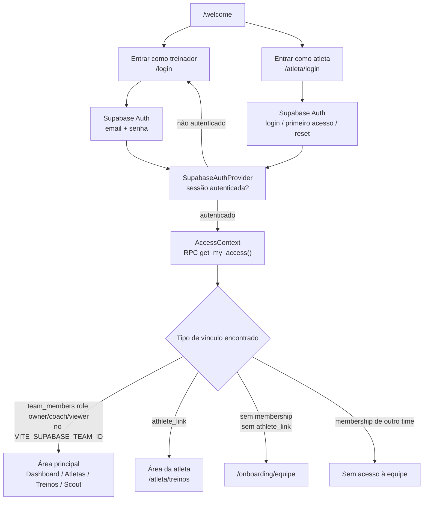
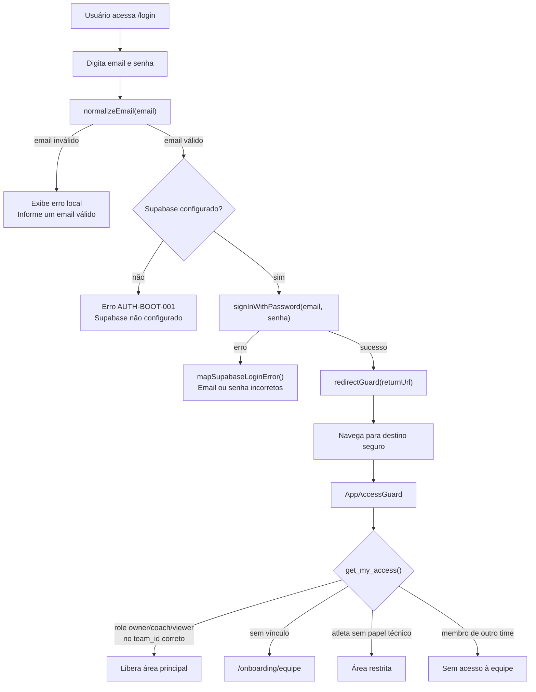
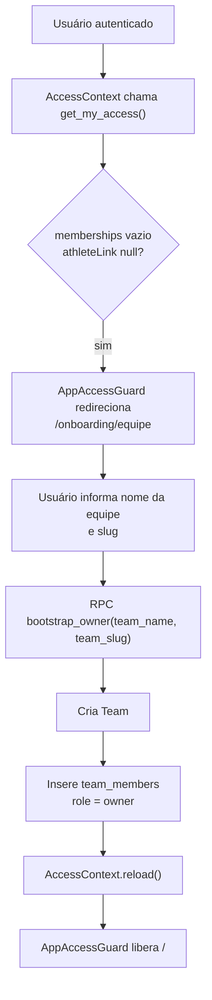
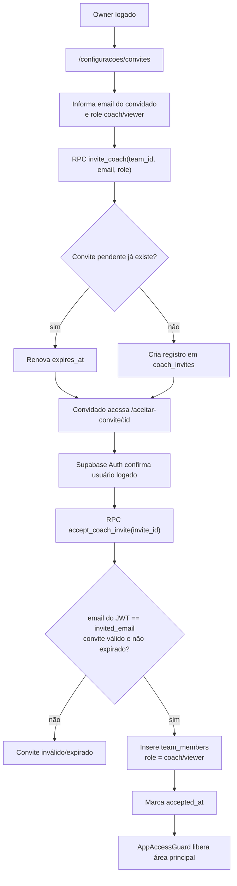
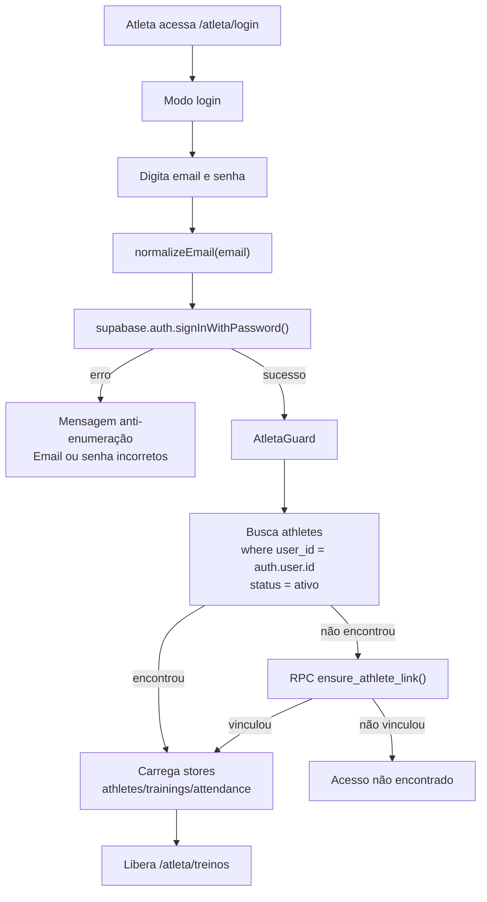
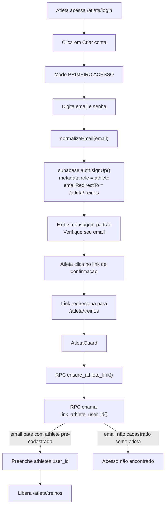
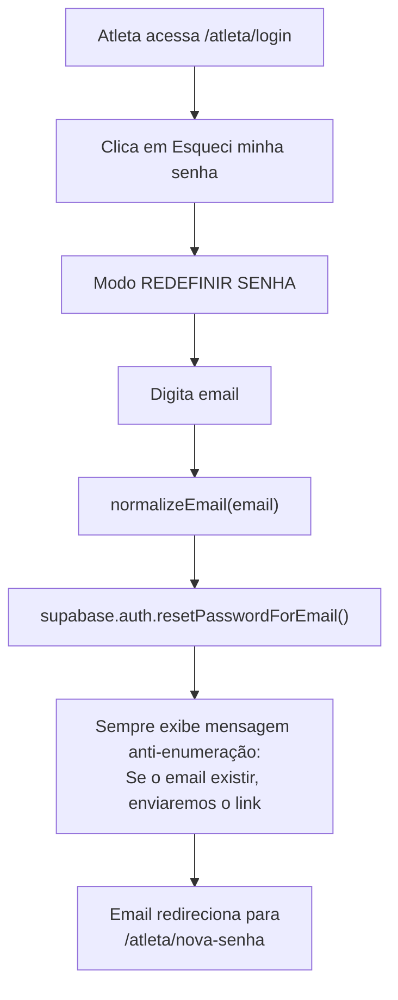
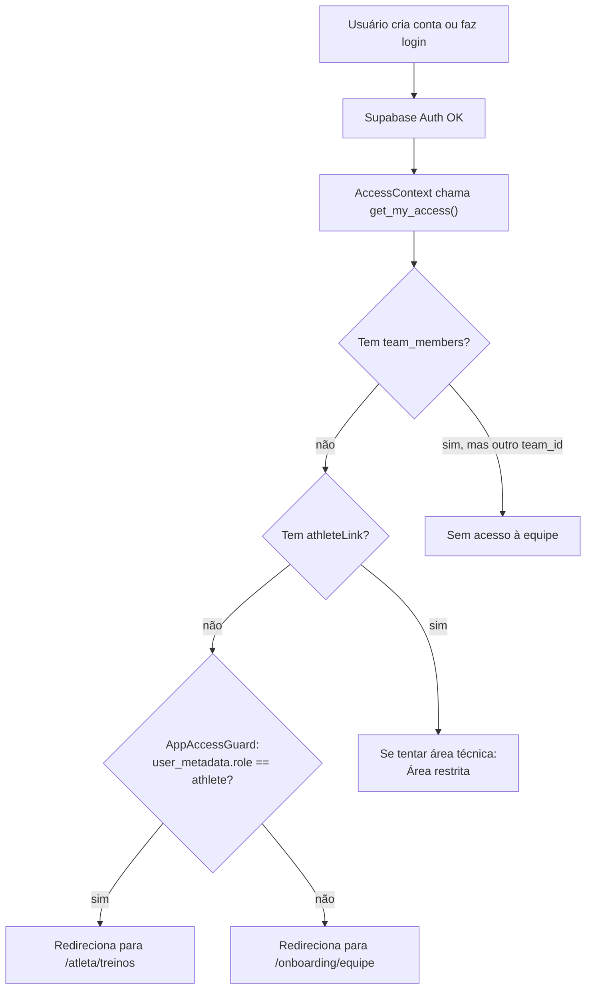
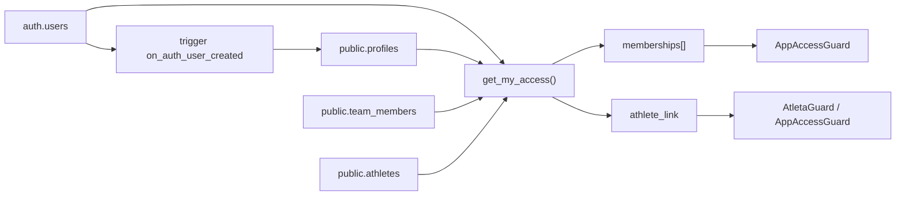

Baseado na `main` atual do repositório, o PWA tem **dois fluxos principais de login**: comissão técnica/treinador e atleta. Eles compartilham Supabase Auth, mas usam guards diferentes: `AppAccessGuard` para a área principal e `AtletaGuard` para a área da atleta. As rotas estão separadas em `App.tsx`: `/login`, `/atleta/login`, `/atleta/nova-senha`, `/aceitar-convite/:inviteId`, `/onboarding/equipe`, área da atleta e área principal. 

## 1. Mapa geral dos acessos



O `AccessContext` chama `get_my_access()` e expõe `memberships`, `athleteLink`, `roleForTeam()` e `hasRole()`.  O `AppAccessGuard` libera a área principal apenas para `owner`, `coach` ou `viewer` vinculados ao `teamId` configurado. 

## 2. Fluxo de login do treinador / comissão técnica



A tela `/login` usa `normalizeEmail()`, `redirectGuard()`, `mapSupabaseLoginError()` e `signInWithPassword()`; após login bem-sucedido, navega para um destino validado.  A sessão em si fica no `SupabaseAuthProvider`, que resolve `session`, `user`, `authenticated`, `configured`, `signInWithPassword()` e `signOut()`. 

## 3. Fluxo de primeiro owner / usuário sem vínculo



Esse fluxo é para uma conta autenticada sem vínculo com equipe e sem vínculo de atleta. A RPC `bootstrap_owner()` cria o time e insere o usuário como `owner`.  O guard envia esse tipo de usuário para `/onboarding/equipe`. 

## 4. Fluxo de convite de coach/viewer



`invite_coach()` só permite owner, aceita `coach` ou `viewer`, reutiliza convite pendente por `team_id + email`, e renova expiração se necessário. `accept_coach_invite()` valida o email autenticado, insere `team_members` e marca o convite como aceito. 

## 5. Fluxo de login da atleta já vinculada



O `AtletaGuard` primeiro tenta encontrar atleta ativa por `user_id`. Se não encontrar, chama `ensure_athlete_link()`; se o vínculo for feito, carrega os dados da área da atleta e libera a rota. 

## 6. Fluxo de primeiro acesso da atleta



A tela da atleta usa modo `register` para primeiro acesso e envia `role: 'athlete'` no metadata do Supabase Auth. O `signUp()` inclui `emailRedirectTo: \`${window.location.origin}/atleta/treinos\`` para que o link de confirmação leve a atleta diretamente à sua área, evitando o redirecionamento para `/onboarding/equipe`. O vínculo real não depende desse metadata para liberar a área: depende de `athletes.user_id` via `ensure_athlete_link()`. 

## 7. Fluxo de redefinição de senha da atleta



A redefinição de senha da atleta usa mensagem anti-enumeração: independentemente de sucesso ou falha, mostra a mesma resposta ao usuário. 

## 8. Fluxo de usuário sem vínculo



Esse é o fluxo para contas sem vínculo de equipe e sem `athleteLink`. A partir do PR #69, o `AppAccessGuard` verifica `user_metadata.role === 'athlete'` (ou `app_metadata.role`) **antes** de redirecionar. Atletas com o metadata correto vão para `/atleta/treinos`, onde o `AtletaGuard` completa o vínculo via `ensure_athlete_link()`. Usuários sem esse metadata seguem para `/onboarding/equipe`. 
## 9. Backend resumido do login



A migration `0040` cria o trigger `on_auth_user_created`, `get_my_access()` e `has_app_access()`.  A migration `0042` faz backfill protegido de `profiles` e `athletes.user_id`, com guardas contra duplicidade e vínculo ambíguo. 

## Pergunta que você não fez, mas precisa responder

Esses fluxos desenham a lógica do sistema. Para fechar o login como DONE, ainda falta validar cada fluxo com contas controladas de produção:

```text id="mad9gr"
1. owner teste
2. coach teste
3. atleta teste
4. usuário sem vínculo teste
```

Sem essas quatro contas, o desenho está correto no código, mas o fluxo real em produção ainda não fica comprovado.

> Itens pendentes para follow-up PR (CEPR-AUTH-02E fase 2):

* Captcha gate em LoginPage (treinador) — precisa VITE_TURNSTILE_SITE_KEY no Vercel

* Bloco [auth.captcha] + [auth] minimum_password_length/password_requirements em config.toml — precisa rotação de senhas existentes

* CHANGELOG.md v2.1 — será commitado via PR (branch protegida)