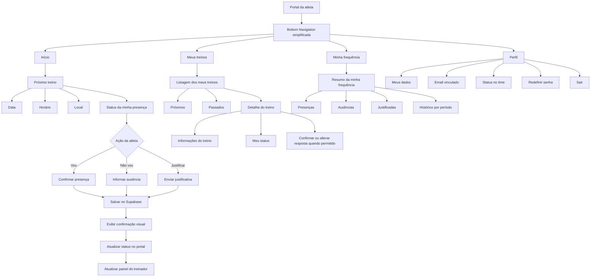

# Diagramas de Navegação — CEPRAEA PWA

## 1. Mapa geral do produto

```mermaid
flowchart TD
    A[CEPRAEA PWA] --> B[Área pública]
    A --> C[Painel do treinador]
    A --> D[Portal da atleta]
    A --> E[Confirmação pública por token]

    B --> B1[/login]
    B --> B2[/atleta/login]
    B --> B3[/atleta/primeiro-acesso]
    B --> B4[/atleta/redefinir-senha]
    B --> B5[/confirmar/:token]

    B1 --> CGuard{AuthGuard treinador}
    B2 --> DGuard{AtletaGuard}

    CGuard -->|Sessão válida| C
    CGuard -->|Sessão inválida| B1

    C --> C1[/app/inicio]
    C --> C2[/app/atletas]
    C --> C3[/app/treinos]
    C --> C4[/app/scout]
    C --> C5[/app/relatorios]
    C --> C6[/app/configuracoes]

    DGuard -->|Atleta vinculada| D
    DGuard -->|Sem vínculo| D0[Tela de acesso bloqueado]
    DGuard -->|Sessão inválida| B2

    D --> D1[/atleta/inicio]
    D --> D2[/atleta/treinos]
    D --> D3[/atleta/frequencia]
    D --> D4[/atleta/perfil]

    E --> E1[/confirmar/:token]
    E1 --> E2{Token válido?}
    E2 -->|Sim| E3[Tela de confirmar presença]
    E2 -->|Não| E4[Link inválido ou expirado]
    E3 --> E5[Presença salva]
    E5 --> E6[Confirmação visual]

    C3 --> X[(Supabase)]
    D2 --> X
    E5 --> X
    X --> C1
    X --> C3
    X --> C5
    X --> D1
    X --> D2
```

---

## 2. Navegação do painel do treinador

```mermaid
flowchart TD
    A[Painel do treinador] --> B[Bottom Navigation]

    B --> C[Início]
    B --> D[Atletas]
    B --> E[Treinos]
    B --> F[Scout]
    B --> G[Relatórios]
    B --> H[Configurações]

    C --> C1[Central de Comando]
    C1 --> C2[Próximo treino]
    C1 --> C3[Resumo de atletas]
    C1 --> C4[Resumo de frequência]
    C1 --> C5[Alertas operacionais]

    C2 --> C2A[Abrir detalhe do treino]
    C5 --> C5A[Atletas sem vínculo]
    C5 --> C5B[Treinos com conflito]
    C5 --> C5C[Presenças pendentes]

    D --> D1[Listagem de atletas]
    D1 --> D2[Buscar atleta]
    D1 --> D3[Filtrar por ativas]
    D1 --> D4[Filtrar por inativas]
    D1 --> D5[Filtrar todas]
    D1 --> D6[Nova atleta]
    D1 --> D7[Detalhe da atleta]

    D6 --> D6A[Dados principais]
    D6 --> D6B[Contato]
    D6 --> D6C[Categoria e nível]
    D6 --> D6D[Status]
    D6 --> D6E[Observações]
    D6E --> D6F[Salvar atleta]

    D7 --> D7A[Editar atleta]
    D7 --> D7B[Ativar ou inativar]
    D7 --> D7C[Ver presença da atleta]
    D7 --> D7D[Ver vínculo de conta]

    E --> E1[Listagem de treinos]
    E1 --> E2[Próximos]
    E1 --> E3[Passados]
    E1 --> E4[Todos]
    E1 --> E5[Gerar recorrentes]
    E1 --> E6[Criar treino extra]
    E1 --> E7[Detalhe do treino]

    E5 --> E5A[Definir período]
    E5A --> E5B[Definir dias da semana]
    E5B --> E5C[Definir horário]
    E5C --> E5D[Definir local]
    E5D --> E5E[Revisar feriados e conflitos]
    E5E --> E5F[Confirmar geração]

    E6 --> E6A[Data]
    E6A --> E6B[Horário]
    E6B --> E6C[Local]
    E6C --> E6D[Tipo de treino]
    E6D --> E6E[Salvar treino extra]

    E7 --> E7A[Resumo de presença]
    E7 --> E7B[Listagem de atletas]
    E7 --> E7C[Marcar presença manual]
    E7 --> E7D[Enviar ou copiar links de confirmação]
    E7 --> E7E[Editar treino]
    E7 --> E7F[Cancelar treino]

    F --> F1[Listagem de jogos]
    F1 --> F2[Novo jogo]
    F1 --> F3[Detalhe do jogo]

    F2 --> F2A[Times]
    F2A --> F2B[Data e local]
    F2B --> F2C[Salvar jogo]

    F3 --> F3A[Registrar eventos]
    F3 --> F3B[Resumo do jogo]
    F3 --> F3C[Encerrar jogo]

    G --> G1[Selecionar período]
    G1 --> G2[Ordenar por nome]
    G1 --> G3[Ordenar por frequência]
    G1 --> G4[Frequência por atleta]
    G1 --> G5[Resumo por treino]
    G1 --> G6[Exportar CSV]
    G1 --> G7[Exportar XLSX]

    H --> H1[Dados da equipe]
    H --> H2[Dados do treinador]
    H --> H3[Local padrão]
    H --> H4[Treinos automáticos]
    H --> H5[Backup e exportação]
    H --> H6[Sair]
```



---

## 3. Navegação do portal da atleta



---

## 4. Rotas e guards

```mermaid
flowchart TD
    A[Usuário acessa rota] --> B{Tipo de rota}

    B --> C[Rota pública]
    B --> D[Rota protegida do treinador]
    B --> E[Rota protegida da atleta]
    B --> F[Rota pública por token]

    C --> C1[/login]
    C --> C2[/atleta/login]
    C --> C3[/atleta/primeiro-acesso]
    C --> C4[/atleta/redefinir-senha]

    D --> D1{Existe sessão Supabase?}
    D1 -->|Não| D2[Redirecionar para /login]
    D1 -->|Sim| D3{Usuário tem acesso de treinador?}
    D3 -->|Não| D4[Exibir acesso negado]
    D3 -->|Sim| D5[Liberar painel do treinador]

    D5 --> D6[/app/inicio]
    D5 --> D7[/app/atletas]
    D5 --> D8[/app/treinos]
    D5 --> D9[/app/scout]
    D5 --> D10[/app/relatorios]
    D5 --> D11[/app/configuracoes]

    E --> E1{Existe sessão Supabase?}
    E1 -->|Não| E2[Redirecionar para /atleta/login]
    E1 -->|Sim| E3{Existe atleta vinculada ao user_id ou email?}
    E3 -->|Não| E4[Exibir conta não vinculada]
    E3 -->|Sim| E5[Liberar portal da atleta]

    E5 --> E6[/atleta/inicio]
    E5 --> E7[/atleta/treinos]
    E5 --> E8[/atleta/frequencia]
    E5 --> E9[/atleta/perfil]

    F --> F1[/confirmar/:token]
    F1 --> F2{Token existe?}
    F2 -->|Não| F3[Link inválido]
    F2 -->|Sim| F4{Token expirado ou revogado?}
    F4 -->|Sim| F5[Link expirado ou indisponível]
    F4 -->|Não| F6[Exibir confirmação de presença]

    F6 --> F7[Salvar resposta]
    F7 --> F8[Exibir sucesso]
```
