# Diagramas de Navegação — CEPRAEA PWA

> **Nota de escopo:** estes diagramas refletem a navegação-alvo alinhada ao PRD oficial atual. Eles representam o contrato de produto esperado e podem estar à frente do runtime hoje implementado em partes do repositório.

## 1. Mapa geral do produto

```mermaid
flowchart TD
    A[CEPRAEA PWA] --> B[Área pública]
    A --> C[Painel do treinador]
    A --> D[Portal da atleta]
    A --> E[Confirmação pública por token]

    B --> B1[/login]
    B --> B2[/atleta/login]
    B --> B3[/atleta/primeiro-acesso]
    B --> B4[/atleta/redefinir-senha]
    B --> B5[/confirmar/:token]

    B1 --> CGuard{AuthGuard treinador}
    B2 --> DGuard{AtletaGuard}

    CGuard -->|Sessão válida| C
    CGuard -->|Sessão inválida| B1

    C --> C1[/app/inicio]
    C --> C2[/app/atletas]
    C --> C3[/app/treinos]
    C --> C4[/app/metas]
    C --> C5[/app/agenda]
    C --> C6[/app/scout]
    C --> C7[/app/relatorios]
    C --> C8[/app/configuracoes]

    DGuard -->|Atleta vinculada| D
    DGuard -->|Sem vínculo| D0[Tela de acesso bloqueado]
    DGuard -->|Sessão inválida| B2

    D --> D1[/atleta/inicio]
    D --> D2[/atleta/treinos]
    D --> D3[/atleta/metas]
    D --> D4[/atleta/scout]
    D --> D5[/atleta/agenda]
    D --> D6[/atleta/convocacoes]
    D --> D7[/atleta/perfil]

    E --> E1[/confirmar/:token]
    E1 --> E2{Token válido?}
    E2 -->|Sim| E3[Tela de confirmar presença]
    E2 -->|Não| E4[Link inválido ou expirado]
    E3 --> E5[Presença salva]
    E5 --> E6[Confirmação visual]

    C3 --> X[(Supabase)]
    C4 --> X
    C5 --> X
    C6 --> X
    D2 --> X
    D3 --> X
    D4 --> X
    D5 --> X
    D6 --> X
    E5 --> X
```

---

## 2. Navegação do painel do treinador

```mermaid
flowchart TD
    A[Painel do treinador] --> B[Bottom Navigation]

    B --> C[Início]
    B --> D[Atletas]
    B --> E[Treinos]
    B --> F[Metas]
    B --> G[Agenda]
    B --> H[Scout]
    B --> I[Relatórios]
    B --> J[Configurações]

    C --> C1[Central de Comando]
    C1 --> C2[Próximo treino]
    C1 --> C3[Plano do dia]
    C1 --> C4[Resumo de atletas]
    C1 --> C5[Metas em atenção]
    C1 --> C6[Agenda competitiva]
    C1 --> C7[Alertas operacionais]

    C7 --> C7A[Atletas sem vínculo]
    C7 --> C7B[Presenças pendentes]
    C7 --> C7C[Convocações sem resposta]
    C7 --> C7D[Metas sem atualização]

    D --> D1[Listagem de atletas]
    D1 --> D2[Buscar atleta]
    D1 --> D3[Filtrar por ativas]
    D1 --> D4[Filtrar por inativas]
    D1 --> D5[Filtrar todas]
    D1 --> D6[Nova atleta]
    D1 --> D7[Detalhe da atleta]

    D6 --> D6A[Dados principais]
    D6 --> D6B[Contato]
    D6 --> D6C[Dados esportivos]
    D6C --> D6C1[Posição ofensiva]
    D6C --> D6C2[Função defensiva]
    D6 --> D6D[Status]
    D6 --> D6E[Observações]
    D6E --> D6F[Salvar atleta]

    D7 --> D7A[Editar atleta]
    D7 --> D7B[Ativar ou inativar]
    D7 --> D7C[Ver presença da atleta]
    D7 --> D7D[Ver vínculo de conta]
    D7 --> D7E[Ver metas da atleta]
    D7 --> D7F[Ver scout da atleta]

    E --> E1[Listagem de treinos]
    E1 --> E2[Próximos]
    E1 --> E3[Passados]
    E1 --> E4[Todos]
    E1 --> E5[Gerar recorrentes]
    E1 --> E6[Criar treino extra]
    E1 --> E7[Detalhe do treino]

    E6 --> E6A[Data]
    E6A --> E6B[Horário]
    E6B --> E6C[Local]
    E6C --> E6D[Tipo de treino]
    E6D --> E6E[Salvar treino extra]

    E7 --> E7A[Resumo de presença]
    E7 --> E7B[Listagem de atletas]
    E7 --> E7C[Marcar presença manual]
    E7 --> E7D[Enviar ou copiar links de confirmação]
    E7 --> E7E[Editar treino]
    E7 --> E7F[Plano do treino]

    E7F --> E7F1[Objetivo principal]
    E7F --> E7F2[Blocos com objetivo específico]
    E7F --> E7F3[Exercícios principais]
    E7F --> E7F4[Observações]

    F --> F1[Listagem de metas]
    F1 --> F2[Metas individuais]
    F1 --> F3[Metas da equipe]
    F1 --> F4[Nova meta]
    F1 --> F5[Detalhe da meta]

    F4 --> F4A[Escolher escopo]
    F4A --> F4B[Escolher origem]
    F4B --> F4C[Definir contexto]
    F4C --> F4D[Salvar meta]

    G --> G1[Agenda da equipe]
    G1 --> G2[Calendário]
    G1 --> G3[Jogos]
    G1 --> G4[Viagens]
    G1 --> G5[Competições]
    G1 --> G6[Convocações]
    G1 --> G7[Detalhe do evento]

    G6 --> G6A[Publicar listagem]
    G6A --> G6B[Acompanhar confirmadas]
    G6B --> G6C[Acompanhar recusas e pendências]

    H --> H1[Central do Scout]
    H1 --> H2[Preparar sessão]
    H1 --> H3[Coleta ao vivo]
    H1 --> H4[Revisão]
    H1 --> H5[Resumo por jogo]
    H1 --> H6[Leitura individual por atleta]

    I --> I1[Selecionar período]
    I1 --> I2[Frequência por atleta]
    I1 --> I3[Resumo por treino]
    I1 --> I4[Evolução de metas]
    I1 --> I5[Resumo competitivo]
    I1 --> I6[Exportar CSV]
    I1 --> I7[Exportar XLSX]

    J --> J1[Dados da equipe]
    J --> J2[Dados do treinador]
    J --> J3[Local padrão]
    J --> J4[Treinos automáticos]
    J --> J5[Backup e exportação]
    J --> J6[Sair]
```



---

## 3. Navegação do portal da atleta

```mermaid
flowchart TD
    A[Portal da atleta] --> B[Bottom Navigation]

    B --> C[Início]
    B --> D[Meus treinos]
    B --> E[Metas]
    B --> F[Scout]
    B --> G[Agenda]
    B --> H[Convocações]
    B --> I[Perfil]

    C --> C1[Próximo treino]
    C1 --> C2[Plano do dia]
    C1 --> C3[Status da minha presença]
    C1 --> C4[Metas em destaque]
    C1 --> C5[Próximo jogo ou viagem]

    C3 --> C6{Ação da atleta}
    C6 -->|Vou| C7[Confirmar presença]
    C6 -->|Não vou| C8[Informar ausência]
    C6 -->|Justificar| C9[Enviar justificativa]

    C7 --> C10[Salvar no Supabase]
    C8 --> C10
    C9 --> C10

    D --> D1[Listagem dos meus treinos]
    D1 --> D2[Próximos]
    D1 --> D3[Passados]
    D1 --> D4[Detalhe do treino]

    D4 --> D4A[Informações do treino]
    D4 --> D4B[Meu status]
    D4 --> D4C[Plano do treino]
    D4 --> D4D[Confirmar ou alterar resposta quando permitido]

    E --> E1[Metas individuais]
    E1 --> E2[Metas criadas por mim]
    E1 --> E3[Metas recebidas do treinador]
    E1 --> E4[Metas recebidas do scout]
    E1 --> E5[Metas da equipe]
    E1 --> E6[Nova meta individual]
    E1 --> E7[Detalhe da meta]

    F --> F1[Scout individual]
    F1 --> F2[Eventos brutos]
    F1 --> F3[Resumo por jogo]
    F1 --> F4[Indicadores agregados]
    F1 --> F5[Histórico por período]

    G --> G1[Agenda da equipe]
    G1 --> G2[Próximos treinos]
    G1 --> G3[Jogos]
    G1 --> G4[Viagens]
    G1 --> G5[Competições]
    G1 --> G6[Detalhe do evento]

    H --> H1[Listagens publicadas]
    H1 --> H2[Convocações abertas]
    H1 --> H3[Convocações respondidas]
    H1 --> H4[Detalhe da convocação]

    H4 --> H4A[Confirmar participação]
    H4 --> H4B[Recusar participação]
    H4 --> H4C[Registrar observação]

    I --> I1[Meus dados]
    I --> I2[Email vinculado]
    I --> I3[Status no time]
    I --> I4[Posição ofensiva]
    I --> I5[Função defensiva]
    I --> I6[Redefinir senha]
    I --> I7[Sair]
```



---

## 4. Rotas e guards

```mermaid
flowchart TD
    A[Usuário acessa rota] --> B{Tipo de rota}

    B --> C[Rota pública]
    B --> D[Rota protegida do treinador]
    B --> E[Rota protegida da atleta]
    B --> F[Rota pública por token]

    C --> C1[/login]
    C --> C2[/atleta/login]
    C --> C3[/atleta/primeiro-acesso]
    C --> C4[/atleta/redefinir-senha]

    D --> D1{Existe sessão Supabase?}
    D1 -->|Não| D2[Redirecionar para /login]
    D1 -->|Sim| D3{Usuário tem acesso de treinador?}
    D3 -->|Não| D4[Exibir acesso negado]
    D3 -->|Sim| D5[Liberar painel do treinador]

    D5 --> D6[/app/inicio]
    D5 --> D7[/app/atletas]
    D5 --> D8[/app/treinos]
    D5 --> D9[/app/metas]
    D5 --> D10[/app/agenda]
    D5 --> D11[/app/scout]
    D5 --> D12[/app/relatorios]
    D5 --> D13[/app/configuracoes]

    E --> E1{Existe sessão Supabase?}
    E1 -->|Não| E2[Redirecionar para /atleta/login]
    E1 -->|Sim| E3{Existe atleta vinculada ao user_id ou email?}
    E3 -->|Não| E4[Exibir conta não vinculada]
    E3 -->|Sim| E5[Liberar portal da atleta]

    E5 --> E6[/atleta/inicio]
    E5 --> E7[/atleta/treinos]
    E5 --> E8[/atleta/metas]
    E5 --> E9[/atleta/scout]
    E5 --> E10[/atleta/agenda]
    E5 --> E11[/atleta/convocacoes]
    E5 --> E12[/atleta/perfil]

    F --> F1[/confirmar/:token]
    F1 --> F2{Token existe?}
    F2 -->|Não| F3[Link inválido]
    F2 -->|Sim| F4{Token expirado ou revogado?}
    F4 -->|Sim| F5[Link expirado ou indisponível]
    F4 -->|Não| F6[Exibir confirmação de presença]
    F6 --> F7[Salvar resposta]
    F7 --> F8[Exibir sucesso]
```
